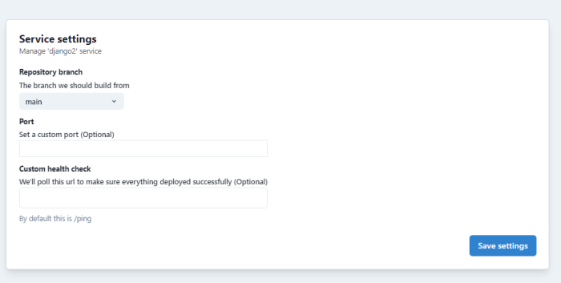

Your service contains several basic settings that you can access by clicking on the settings for your stack (the gear icon for your stack on the TinyStacks dashboard). From the settings page, under Stack settings, you will see a dropdown listing your services. 

By default, you will see the initial service you deployed listed here. If you deployed additional services (sidecars), you will be able to select them here and set different settings for each sidecar service. For more details, see [Sidecars](sidecars.md).

### Settings

### Repository branch

The branch from which your service's container is built. Any check-ins to this branch will trigger an automatic rebuild and (unless [manual deployment](stages.md) is enabled for a stage) a deployment through your stack's stages. 

### Port 

The port through which your application is exposed on the Internet. By default, this is port 80. 

### Custom health check

The URL used to determine if your application's container instances are healthy or unhealthy. By default, this is `/ping`. You can change it to another path hosted on your application container. 

If you change the health check path, please keep a few things in mind: 

* A ping check should return an HTTP 200 OK message if it is healthy. Responses should generally be fast so as not to run the risk of a request timeout. 
* If your custom health check breaks, it could result in your application "churning" - i.e., in container instances being repeatedly stood up and torn down because they appear unhealthy. This will result in your application going offline.  As such, it's best to keep your health checks short and simple. 