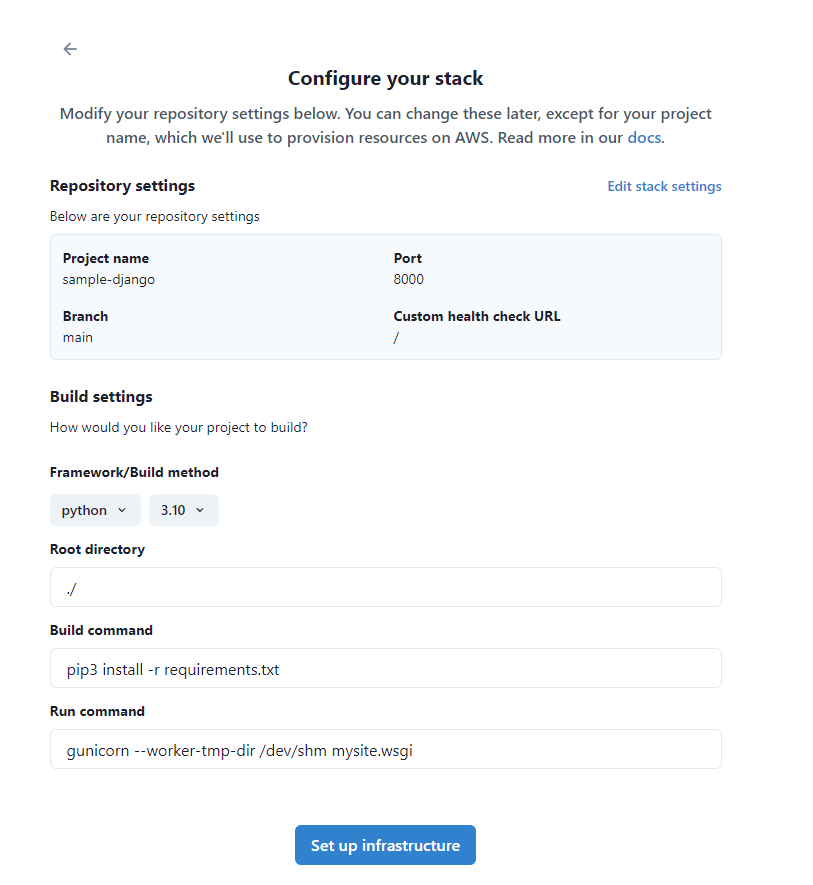
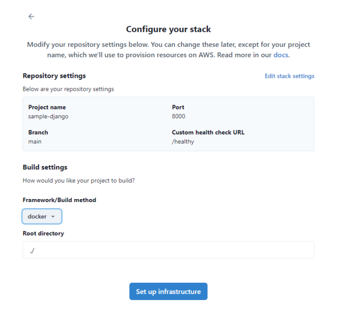

Deploying your application on TinyStacks is as easy as checking a change into source control. Behind the scenes, the process is divided into three parts: 

* **Build**. Compiles your new container containing your application.
* **Release**. Tags the new container image, pushes it to your Elastic Container Repository (ECR), and initiates the deployment.
* **Deployment**. Runs your container on your serverless endpoints or your ECS cluster instances. 

The results of each process are logged in separate logs in the TinyStacks console. For more, see [Logging and Monitoring](logging-monitoring.md).

### When are deployments run? 

Deployments are run whenever you check in a change from Git. TinyStacks will also start a deployment update whenever you add a new build environment variable or runtime environment variable to your stack or one of its stages.

## Files required in your project

When you create a new stack, you'll be asked to select a framework. If you select any framework besides Docker, TinyStacks will manage the build, release, and deployment process behind the scenes. You don't even need a Dockerfile in your repository - TinyStacks will "auto-Dockerize" your project for you. 



If you're using another framework, you will need to create a Dockerfile and upload it to your connected repository. You will also need to download build.yml and release.yml files and upload them to your Git repository. TinyStacks provides copies of these files for you to install before launching your stack for the first time.



## Build and release files

To manage build and releases in a Docker deployment, TinyStacks utilizes two files in your repo: a build.yml file and a release.yml file. 

### build.yml

The build.yml file is run only once per Docker container image. The build.yml file must tag an image with the tag `:latest` by the end of the build. It also adds a tag containing the Git repository commit that kicked off the build. 

```
version: 0.2
phases:
  build:
    commands:
      - docker login -u AWS -p $(aws ecr get-login-password --region $AWS_REGION) $ECR_ENDPOINT
      - docker build -t builtimage .
      - docker tag builtimage:latest $ECR_IMAGE_URL:latest
      - docker tag builtimage:latest $ECR_IMAGE_URL:$(git rev-parse HEAD)
      - docker push $ECR_IMAGE_URL:latest
      - docker push $ECR_IMAGE_URL:$(git rev-parse HEAD)
```

You can apply as many additional tags as you like. The only restriction is that your tags cannot have the same name as one of the stages in your stack. 

#### Build stage environment variables created by TinyStacks

TinyStacks defines the following build environment variables to each build. These are immutable and your build cannot override them: 

| Environment variable | Description                                                                                                                               |
|---------------------------|-------------------------------------------------------------------------------------------------------------------------------------------|
| S3_BUCKET                 | The Amazon S3 bucket where logs and build artifacts are stored.                                                                           |
| ECR_ENDPOINT              | The Amazon ECR repository where your application's Docker container image is stored.                                                      |
| ECR_IMAGE_URL             | The full URL to your container image.                                                                                                     |

### release.yml

Your release.yml file is run with every stage deployment (dev, staging, prod, etc.). The default release.yml supplied by TinyStacks tags your image created in the last stage with the name of the current stage and prepares a new deployment. 

```
version: 0.2
phases:
  build:
    commands:
      - docker login -u AWS -p $(aws ecr get-login-password --region $AWS_REGION) $ECR_ENDPOINT
      - docker pull $ECR_IMAGE_URL:$PREVIOUS_STAGE_NAME
      - docker tag $ECR_IMAGE_URL:$PREVIOUS_STAGE_NAME $ECR_IMAGE_URL:$STAGE_NAME
      - docker push $ECR_IMAGE_URL:$STAGE_NAME
      - |
        if [ ! -z "$REGIONAL_ECR_ENDPOINT" -a ! -z "$REGIONAL_ECR_IMAGE_URL" ];
          then
            docker login -u AWS -p $(aws ecr get-login-password --region $STAGE_REGION) $REGIONAL_ECR_ENDPOINT
            docker tag $ECR_IMAGE_URL:$PREVIOUS_STAGE_NAME $REGIONAL_ECR_IMAGE_URL:$STAGE_NAME
            docker push $REGIONAL_ECR_IMAGE_URL:$STAGE_NAME
        fi
  post_build:
    on-failure: CONTINUE
    commands:
      - region="${STAGE_REGION:-$AWS_REGION}" 
      - |
        if [ ! -z "$LAMBDA_FUNCTION_NAME" -a  "$LAMBDA_FUNCTION_NAME" != "placeholder" ];
          then
            imageUrl="${REGIONAL_ECR_IMAGE_URL:-$ECR_IMAGE_URL}" 
            aws lambda update-function-code --function-name "$LAMBDA_FUNCTION_NAME" --image-uri "$imageUrl:$STAGE_NAME" --region $region
            imageSha=$(docker images --no-trunc --quiet $imageUrl:$PREVIOUS_STAGE_NAME);
            aws lambda tag-resource --resource "$LAMBDA_FUNCTION_ARN" --tags "IMAGE_SHA=$imageSha" --region $region
          else
            echo 'Not a serverless stage'
            if [ -z "$SERVICE_NAME" ] || [ "$SERVICE_NAME" == "placeholder" ];
              then
                echo 'Service is not ready yet. Repository tagged correctly, exiting now';
              else
                TASK_ARN=$(aws ecs describe-services --cluster $CLUSTER_ARN --services $SERVICE_NAME | jq -r '.services[].taskDefinition') 
                TASK_DEFINITION=$(aws ecs describe-task-definition --task-definition  "$TASK_ARN" | jq -r '.taskDefinition')
                CONTAINER_DEFINITIONS=$(jq -r '.containerDefinitions' <<< $TASK_DEFINITION)
                COMMIT_SHA=$ECR_IMAGE_URL:$(git rev-parse HEAD)  
                CONTAINER_INDEX=$(echo $CONTAINER_DEFINITIONS | jq --arg IMAGE_URL "$ECR_IMAGE_URL" 'map(.image | contains($IMAGE_URL)) | index(true)' )
                NEW_TASK_DEFINTIION=$(echo $TASK_DEFINITION | jq --arg IMAGE "$COMMIT_SHA" --arg INDEX "$CONTAINER_INDEX" '.containerDefinitions[$INDEX | tonumber].image = $IMAGE| del(.revision) | del(.status) | del(.statusString) | del(.registeredAt) | del(.taskDefinitionArn) | del(.compatibilities) | del(.requiresAttributes) | del(.registeredBy)' )
                NEW_DEF_ARN=$(aws ecs register-task-definition --cli-input-json "$NEW_TASK_DEFINTIION" | jq -r '.taskDefinition.taskDefinitionArn')
                aws ecs update-service --service $SERVICE_NAME --cluster $CLUSTER_ARN --task-definition "$NEW_DEF_ARN" --force-new-deployment
            fi
        fi
```

For serverless deployments, the release will deploy your built container to the AWS Lambda function hosting your application. For container deployments, it will update your Elastic Container Services (ECS) cluster nodes with the latest container image. 

The release is configured so that your code can be deployed to any region. This enables multi-region deployments in TinyStacks - i.e., having multiple production stages that exist in different AWS regions. For more information, see [Stages](stages.md).

#### Release stage environment variables created by TinyStacks

TinyStacks defines the following release environment variables to each build. These are immutable and your release cannot override them: 

| Environment variable | Description                                                                                                                               |
|---------------------------|-------------------------------------------------------------------------------------------------------------------------------------------|
| S3_BUCKET                 | The Amazon S3 bucket where logs and build artifacts are stored.                                                                           |
| STAGE_NAME                | The name of the current stage.                                                                                                            |
| ECR_ENDPOINT              | The Amazon ECR repository where your application's Docker container image is stored.                                                      |
| ECR_IMAGE_URL             | The full URL to your container image.                                                                                                     |
| PREVIOUS_STAGE_NAME       | Name of the previous stage in your stack. For the first stage in a stack, this will always be `:latest`.                                  |
| CLUSTER_ARN               | The Amazon Resource Name (ARN) that uniquely identifies the Amazon ECS cluster that TinyStacks creates to run and scale your application. |
| SERVICE_NAME              | The name of the ECS service that runs and scales your container image.                                                                    |
| STAGE_REGION              | The AWS region in which this stage is being launched.                                                                                     |

## Advanced topics

### Managing multiple projects in a single repository ("monorepo") 

For ease of management, many teams prefer to maintain multiple projects in a single repository, creating a so-called "monorepo". For example, a team may decide to construct its application as a set of microservices, with each service stored in a subdirectory within a single Git repo. 

To use TinyStacks with monorepos, create one TinyStacks stack for each service in your monorepo. Next, you will need to add as build environment variable called `DOCKERFILE_PATH` to each stack that points to the relative path to your Dockerfile. Finally, modify your build.yml so that it builds your service using this file path:

```
- docker build -t builtimage . -f $DOCKERFILE_PATH
```

For more information, see [Environment variables](environment-variables.md).