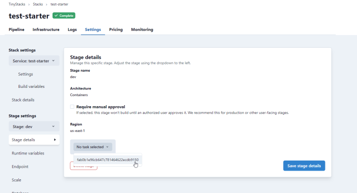
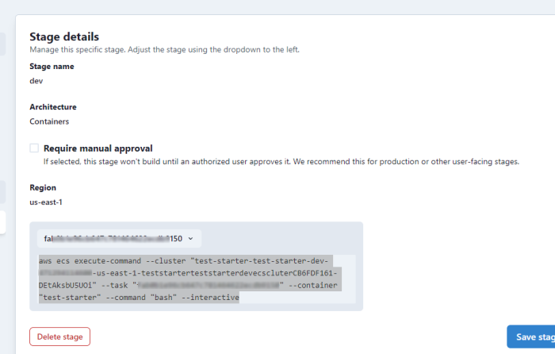
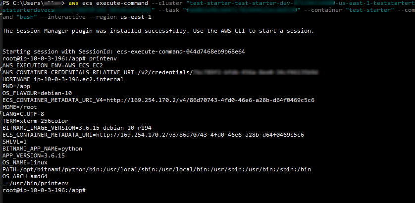

As discussed on our [Architecture](architecture.md) page, TinyStacks uses Amazon Elastic Container Service (ECS) to host your application's Docker containers. 

## Your ECS Cluster 

On AWS, containers can be hosted in one of two ways: 

* On an ECS cluster (a group of Amazon ECS virtual machine instances) hosted on your AWS account; or
* Via AWS Fargate, a fully managed container hosting service. 

Fargate still runs your container on clusters of EC2 instances. However, these instances are managed by AWS and are never visible in your account. In Fargate, your container may run on the same EC2 instances as containers launched by other AWS customers. 

TinyStacks uses EC2 clusters hosted in your own AWS account. The primary considering behind this decision was cost. Our own experiments showed that <a href="https://blog.tinystacks.com/ecs-serverless-or-not-fargate-vs-ec2-clusters" target="_blank">using EC2 instances resulted in a 40% cost savings</a> to our customers. 

## ECS services

There are two ways to run containers on ECS. One is to run individual tasks, or running instances of your container. The other is to run your container as a service. An ECS service runs a specified number of instances of your container on your cluster. 

Using a service provides an additional level of quality for your application. If a container task fails and stops running, ECS can detect this and replace it with a new, healthy instance. ECS services also contain logic to limit container re-spawn and thus reduce thrashing. 

TinyStacks uses the `REPLICA` service scheduler strategy, which spreads task instances evenly across cluster instances and AWS availability zones (AZs). This ensures high application reliability should a single AZ become unavailable. 

For more information, <a href="https://docs.aws.amazon.com/AmazonECS/latest/developerguide/ecs_services.html" target="_blank">see the AWS documentation on services</a>.

### Running and updating your container

Your container is defined using a <a href="https://docs.aws.amazon.com/AmazonECS/latest/developerguide/task_definitions.html" target="_blank">task definition</a>, a versioned specification that defines various parameters for your running container. 

When you publish a new version of your application, TinyStacks creates a new version of the task definition and publishes it to the service. Your service will gradually spin down instances of its old container and spin up instances of the new one in order to prevent any service interruptions. 

### Accessing container task instances

You may need to access your container task instances for troubleshooting purposes. You can do this using the command `aws ecs execute-command` from the AWS Command Line Interface (CLI). 

To use this feature, first ensure you have <a href="https://docs.aws.amazon.com/cli/latest/userguide/cli-chap-getting-started.html" target="_blank">installed and configured the AWS CLI</a>. You will also need to configure <a href="https://docs.aws.amazon.com/systems-manager/latest/userguide/session-manager-working-with-install-plugin.html" target="_blank">the AWS Systems Manager Session Manager plugin</a>.

Once installed, you can find the command for logging into your stage's instances on the TinyStacks dashboard. On the page for your stack, find the stage whose instances you need to access and click the gear icon. Under **Stage settings**, select **Stage details**. There, you will see a button that lets you select one of your running tasks. 

Once you select a task, TinyStacks will display the exact syntax of the `aws ecs execute-command` command you need. Copy this text to your clipboard. 

Finally, run this command at a command prompt on your operating system. (Either Windows or Linux command prompts will work; Windows Powershell is shown below.) If your AWS CLI credentials are set for a different AWS region than your cluster is in, use the `--region` parameter as shown below to force the command to run in the same AWS region as your stage. 

Once run, you will be connected to an interactive Linux prompt for your stack. From there, you can run any Linux command required to check on the status of your task instance and its environment. The example below shows using the `printenv` command to inspect environment variables.

## Scaling

You can configure your application to scale to handle increased load in one of two ways: 

* Scaling out the number of Amazon EC2 instances running in your ECS cluster.
* Scaling out the number of running instances of your container. 

For detailed information, see [Autoscaling](autoscaling.md). 