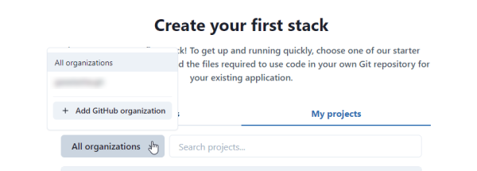

As discussed in our [getting started guide](service-connections.md), you need to establish service connections to AWS and your GFit repositories on Gitlab or GitHub in order to use TinyStacks. Below are some additional details on what permissions are granted and how to manage your connections. 

## Github authorized apps

When you create a connection to GitHub, you need to authorize two separate applications: 

* The GitHub TinyStacks authorized app. This authorizes TinyStacks to verify your identity, list the resources you have access to, and perform other actions on your behalf. 
* The GitHub TinyStacks app. This app controls access to specific organizations and repositories. It includes access to your metadata, read and write access to a number of features, and administrator access to repository projects. 

GitHub authorization occurs in two steps. First, you authorize the GitHub authorized app when you initially create your GitHub connection. You then authorize the TinyStacks app on the Create Stack page when you click the **Add organization** button under **All organizations**. 

## Disconnecting from Github

Disconnecting from Github requires removing both the app and the authorized app from your GitHub account. To disconnect from GitHub: 

1. From the TinyStacks console, click your email address in the upper right hand corner and then click **Connections**. (You can also access the apps directly on your GitHub account by clicking your profile in the upper right hand corner, selecting **Settings**, and then selecting **Applications** on the left hand navigation menu.)
1. Under **Your connections**, next to GitHub, click **Disconnect**. This will take you to your GitHub account. 
1. Under **Authorized GitHub apps**, find the entry labeled **TinyStacks** and click **Revoke**. 
1. Once that is done, click the tab **Installed GitHub apps** and click **TinyStacks**. Find the TinyStacks app and click **Configure**.
1. At the bottom of this page, next to **Uninstall TinyStacks**, click **Uninstall**. 