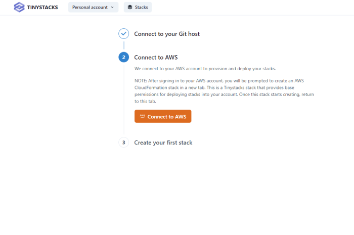
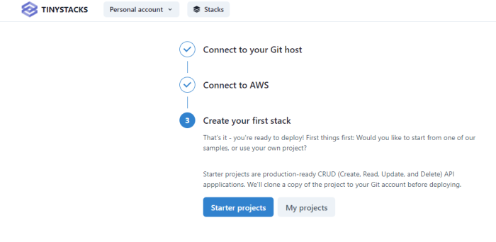

The following guide is for first-time TinyStacks users. Follow these instructions to launch one of our sample applications on AWS in under 15 minutes!

## Prerequisites

You will need the following resources set up before you start using TinyStacks: 

* A Git account with either <a href="https://github.com" target="_blank">GitHub</a> or <a href="https://gitlab.com" target="_blank">GitLab</a>.
* <a href="https://aws.amazon.com" target="_blank">An AWS account</a>. All of the resources TinyStacks creates for you will be hosted in an AWS account that you own. Don't worry - you cna get started without any previous knowledge of AWS!

## Configure Git connection

When you first log in to TinyStacks, you’ll need to wire up a supported Git repository account as well as an AWS account. TinyStacks supports using Git repositories hosted on GitHub or GitLab. 


Select which Git service you plan to use: GitHub or Gitlab. A separate window will open. If you are not logged in to your selected service, you will be prompted to log in now. 


Once logged in, you will need to grant authorization for TinyStacks to access your GitHub or GitLab account. This will allow us to add a repository to your account (if you use one of our starter projects) or read an existing repository (if you use your own project). 

## Configure AWS account 

Once you've authorized your Git account, you will be prompted to authorize an AWS account. This account will host all of the cloud resources required by your application. 




If you have not logged in to your AWS account recently, you will be prompted to do so. 

Once you have logged in to AWS, you will see the following screen, which prompts you to create an AWS CloudFormation stack in your AWS account. This step is **necessary** in order to proceed and fully connect your account. This CloudFormation template will create an AWS Identity and Access Management (IAM) role that TinyStacks will assume in order to create resources in your account.


(*Note*: Some elements of the screen above have been blurred out for security reasons.)

To create this stack, select the box **I acknowledge that AWS CloudFormation might create IAM resources**. Then, click the **Create Stack** button. 

After creating the stack, tab back to the previous tab containing the TinyStacks window. Once the stack has completed creating, TinyStacks will automatically detect this and move you to the next step in the stack creation process. Once you see the screen below, you can proceed. 



## Select a starter project

Next, you'll be prompted to select a project. You can either select a TinyStacks starter project or use your own project. For this guide, we'll be using a starter project, so go ahead and click the **Starter projects** button.

The TinyStacks starter projects are simple Create/Read/Update/Delete (CRUD) database applications written in the application framework of your choice. You can click the name of any starter project in the window below to see its repository on GitHub and check out its README, which gives a detailed description of the app's code and deployment architecture.


Once you select a project, TinyStacks will copy its code into your Git account, where you can use it as a basis for further development. 

For this guide, let's create <a href="https://github.com/tinystacks/aws-docker-templates-express" target="_blank">an Express project</a>. Next to Express in the window above, click **Deploy**. 

On the next screen, you'll be prompted to give your project a name. Choose a simple, short name that's 20 characters or less. (The name will be used as a prefix for some of the resources in your AWS account, so we want to keep it short to avoid going over naming length limits in AWS.)


## Customize your deployment

You have one more step to go and then you're ready to launch your stack! After clicking **Deploy**, you'll see the screen below, which enables you to fine-tune multiple settings for the first stage of your stack. 


This screen visualizes all of the AWS resources that TinyStacks will use or create on your behalf. These components and what they contribute to your stack are discussed in detail [in our architectural guide](architecture.md). Briefly, they include: 

* Your **Git repo** (either GitHub or GitLab) that holds your application code. 
* **AWS CodeBuild** to build and deploy your project as a Docker container. 
* An **Amazon Elastic Container Repository (ECR) repo** for storing your Docker container's versions. 
* An **Amazon Elastic Container Service (ECS) cluster** for hosting your running Docker containers. 
* **Amazon API Gateway** for routing traffic to your application's exposed endpoints. 
* **Amazon CloudWatch** for monitoring performance and storing application logs.
* An optional **database** for storing application data. 

Additionally, you can see and configure several additional options: 

* The **AWS pricing breakdown** gives you a sense of what you'll per month for your stack in its current configuration. 
* You can define **Environment variables** as name-value pairs that will be exposed as environment variables to your running application's Docker container. 

If a tile has a gear icon in the upper right corner, you can click it to configure advanced options for that tile. Configurable options include: 

* **Database**. Click **Enable** to create an Amazon RDS Postgres database for your account. Use the settings option to select an existing database instead and to configure other database-related options. 
* **Amazon ECS**. Configure build and scale settings for your Amazon ECS cluster, such as the size of the Amazon EC2 instances used in your cluster. 
* **Amazon API Gateway**. Choose between using Amazon API Gateway or Application Load Balancer for front end application routing. 

You can change any of these options now or change them later, after your original deployment. Your stack will also build as is, without any additional configuration. For now, start the creation of your first stack by clicking **Build**.

## Testing your stack

Your stack will take a few minutes to build. Once it's done, you'll be taken to the **Stacks** page on your TinyStacks account, where you can see your running stack listed. 


Click on your stack's name to navigate to the Stack Details page. 


This page shows your stack and all of the stages you've defined. The initial stack creation process creates a single stage named `dev`. You can use the **Add stage** button to add more stages at any time.

For now, let's tets out the dev stack and ensure it's working. On the lower right corner of the `dev` box, click **Copy endpoint**. Then, open a new tab in your Web browser, paste in the copied URL, and press `Enter`. You should navigate to the Express application's ping page, which should return a string reading `Healthy connection`.


You can also test other endpoints of the API as defined by the Express app README. For example, to add an item to the application's memory, you can use the following command on Linux systems. Be sure to replace `my-domain-name` with the domain portion of your application's URL, which will be of the form `unique-id.execute-api.us-east-1.amazonaws.com`: 

```
curl -H "Content-Type: application/json" -X PUT -d '{"title":"my title", "content" : "my content"}' "https://my-domain-name/item"
```

On Windows Powershell, use the following command: 

```
$item = @{
    title="my title"
    content="my content"
}
$json = $item | ConvertTo-Json
$response = Invoke-WebRequest 'https://my-domain-name/local-item' -Method Put -Body $json -ContentType 'application/json' -UseBasicParsing
```

If everything is configured correctly, you'll receive a 200 HTTP response status code for the operation. 

Congratulations - you've deployed your first stack!

## Push your first commit

Your stack is configured to deploy any changes you make to your code automatically to your dev stage. To see this in action, let's make a small change to your code. 

Navigate to your Git repo. You can do this easily by clicking on the GitHub or GitLab icon on your stack's tile on the Stack Details page.


In the repository, navigate to the file `src/server.ts`. Copy the `/ping` method and create a new method called `/pong`. Return a custom message from the method in the response: 

```
app.get("/ping", (req, res) => {
  res.status(200).send("Setting a custom message");
});
```

Next, commit your change. In the GitHub UI, you can do this by clicking the **Commit changes** button at the bottom of the page you're editing. 


Return to TinyStacks and to the Stack Details page for your stack. Within a couple of minutes, you should see that TinyStacks has picked up the change to your application and is applying the changes to your stack.


The first tile will spin while it is building your changes into a new Docker container. Then, you will see the `dev` stage update as the change is deployed. Wait until the change has propagated to your dev stage. Then, test the `/pong` URL with cUrl to see your new endpoint. On Linux, run the following command:

```
curl https://my-domain-name/pong
```

On Windows Powershell, use: 

```
curl https://my-domain-name/pong -UseBasicParsing
```