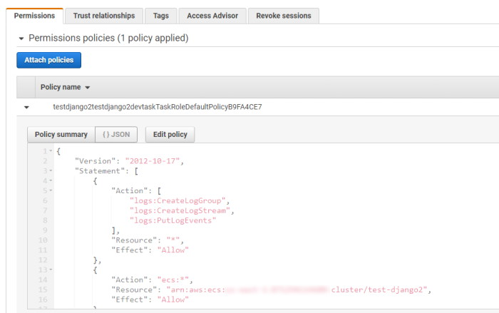

TinyStacks contains many of the capabilities you'll need to run your application out of the box. But we also understand that some customization will always be required. In a few cases, you may need to make significant additions to your stacks for them to function properly. 

TinyStacks supports extending and building upon your stack's architecture and operation in a number of ways. 

## Connecting to other AWS resources from your application

As you grow your application, you will likely want to incorporate access to other AWS services. Common examples include DynamoDB for NoSQL data storage and Amazon S3 for storing blobs and other large data. 

Currently, there are two ways to do this on TinyStacks. Note that both operations require knowledge of AWS Identity and Access Management (IAM). 

### Pass AWS credentials as runtime variables

You can create an AWS access key and secret key and pass these variables as runtime variables as described above in <a href="#pass-custom-variables-and-configuration-data-to-each-stage">passing runtime variables to a stage.</a>

Note that, if you do this, anyone with access to your TinyStacks account has access to these variables, and thus to your underlying AWS account. Please proceed with caution. 

### Modify the IAM role for your application

Your Amazon ECS tasks all run with an IAM task role that determines their AWS permissions. The task role name is a combination of the stack name, the stage name, and the phrase "TaskRoleDefaultPolicy". For example, below is the IAM role for the dev stage for a stack named `test-django2`. 

By default, this role only has permission to push events to your Amazon CloudWatch Logs log group. You can modify it with a valid IAm policy to grant it access to additional AWS resources. 

## Custom post-deploy events

You may want to take additional actions after a TinyStacks deployment finishes. This may be as simple as notifying your team that a deployment on a specific stage has completed. Or you may even want to run custom code that takes additional actions, such as calling third-party APIs or even standing up additional AWS infrastructure. 

TinyStacks supports triggering custom build events on your stack via an email notification. You can send a JSON-formatted email to a service such as <a href="https://aws.amazon.com/ses/" target="_blank">Amazon Simple Email Service (SNS)</a>, which can further trigger running custom code such as an AWS Lambda function. 

