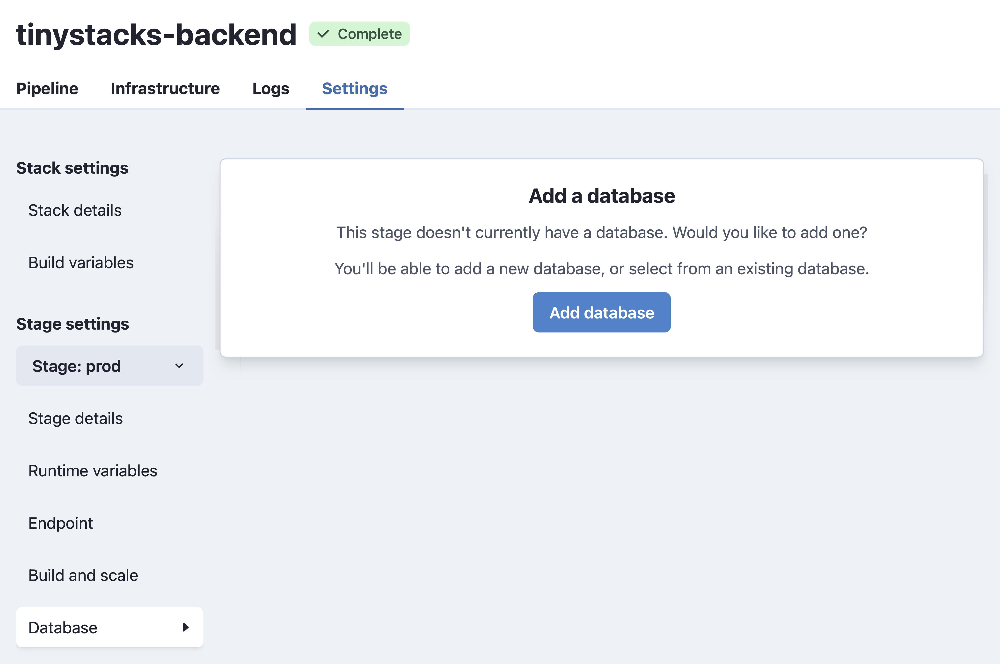

TinyStacks supports creating a database as part of your stack. You can also choose to pass in a database you have already created in your AWS account. 

## Changing your stack's database settings

<a href="https://tinystacks.com/stacks/" target="_blank">Go to your Stacks page</a> and, for the stack you want to modify, click the gear icon in the lower right corner. This will open the **Settings** page. In the left hand column, under **Stage**, select the stage to which you want to add a database. Then, from the same column, select **Database**. 

You will see two different screens here depending on whether your stage currently has a database or not. If it has a database, you will see a screen that enables you to change the instance type for your database as well as the amount of disk storage used. 


If your stage currently has no database, you will see the following screen. You can either add a new Postgres or MySQL database, or add another existing AWS database to your stack. 



*Note*: Saving your changes will trigger a rebuild of your stage. Your application may not be accessible on this stage until the rebuild and redeploy has completed. 

## Connecting to your database from your application

When you have TinyStacks create a database for you, we push all information about the database - including username and password - into a set of runtime variables. These are exposed to your application as environment variables in your Docker container instances. 

If you create a Postgres database, the variables pushed include: 

* **PG_HOST**: The IP address
* **PG_PORT**: The port on which the Postgres database is running
* **PG_CREDENTIALS_SECRET**: The password for connecting to your Postgres database
* **PG_DATABASE**: The name of the database on the database host server

For MySQL, the variables are:

* **MYSQL_HOST**: The IP address
* **MYSQL_PORT**: The port on which your MySQL database is running
* **MYSQL_CREDENTIALS_SECRET**: The password for connecting to your MySQL database
* **MYSQL_DATABASE**: The name of the database on the database host server

Your application code should be able to access these values the same as it would any other environment variable (e.g., <a href="https://nodejs.dev/learn/how-to-read-environment-variables-from-nodejs" target="_blank">`process.env` in Node.js</a> or <a href="https://www.nylas.com/blog/making-use-of-environment-variables-in-python/" target="_blank">`os.environ.get()` in Python</a>).


## Using a bastion host

By default, your database is only accessible [from the same VPC](networking.md) in which your application runs. However, many teams will want to connect directly to their databases to run queries with tools like MySQL Workbench. 

To enable these scenarios, you need to create <a href="https://aws.amazon.com/premiumsupport/knowledge-center/rds-connect-using-bastion-host-linux/" target="_blank">a **bastion host**</a>. The bastion host is an Amazon EC2 instance that sits in your VPC and creates a secure SSH tunnel so you can connect to your database. The SSH connection requires using public key cryptography, which prevents unauthorized users from connecting to your bastion and attempting to access your database. 

### Creating a bastion host

You can create a bastion host when you initially launch your stack and configure your database. If you didn't add a database to your stack yet, you can navigate to Stack Settings for your stack and add it under **Stage settings** -> **Database**.

### Connecting to your bastion host 

To connect to your database, navigate to your stack's **Stack settings** page. Under **Stage settings** -> **Database**, you'll see a box labeled **Bastion connection information**. Here, you can download the private key you'll need to connect to your database. 


Once downloaded, place your private key somewhere on your computer where you can reference it easily. Make sure you secure the machine on which the private key exists; anyone with access to this key and your bastion's connection information could use this to attempt to gain access to your database. 

The ssh command provided doesn't connect you directly to the bastion. Rather, it connects you to your database, using the bastion host as a tunnel. The various arguments to the command have the following meaning: 

* `-i`: Ensures the connection is made using a private key that matches to a public key on the server.
* `-L`: Designates the connection as a tunnel. The argument specifies a localhost port, the bastion endpoint, and the port on the RDS database. This port will differ if you use different database systems (5432 for Postgres, 3306 for MySQL, etc.). 
* `-f`: Forces the SSH connection into the background. 
* `-N`: Prohibits remote command execution on the bastion - the connection can only forward commands to the Amazon RDS database. 

After you open this tunnel, you can use your sql client or CLI to connect to the database using the credentials found in AWS Secrets Manager (see below). Instead of using the RDS endpoint as host, you specify `localhost`. 

If you prefer to use a visual tool, like MySQL Workbench, <a href="https://dev.mysql.com/doc/workbench/en/wb-mysql-connections-methods-ssh.html" target="_blank">you can configure the tool to connect to your database via an SSH tunnel</a> using your connection information and your SSH private key. Consult your tool's documentation for detailed constructions on configuring SSH tunnels.

### Accessing your database's credentials (username and password)

You will, of course, still need your database's username and password to connect to it!

Your database username and password are stored securely in your AWS account using <a href="https://console.aws.amazon.com/secretsmanager/" target="_blank">AWS Secrets Manager</a>. You can see these secrets by navigating to AWS Secrets Manager in your AWS account. 


You can identify the correct secret for your application from the AWS Console in two ways: 

* The **Secret description** of the stack, which will contain the name you gave your stack at stack creation time. 
* The tag **aws:cloudformation:stack-name**, which will also contain the name of your secret. 

If you have multiple stages, you will have multiple secrets. You can distinguish them by the name of the secret, which will have the name of the stage pre-pended. In this example, since this is our database for our dev stage, it starts with the prefix `dev`. 

In the AWS Console, you can see the information stored in this secret by expanding the **Secret value** dropdown. There, you can see all of the information required to connect to your database. 


If you need to retrieve these values programmatically, you can do so using the AWS Command Line Interface (CLI) or any of the APIs available for programmatic access. For example, using the AWS CLI, you can retrieve the secret you need by searching for all secrets where the tag `aws:cloudformation:stack-name` matches your stack name. You can then use the command `jq` to filter out the return values to get the correct database for your stage. 

```
aws secretsmanager list-secrets --region us-east-1 --filters Key=tag-key Values=aws:cloudformation:stack-name Key=tag-value,Values=test-django2 | jq '.[][] | select(.Name|test("^dev"))
```