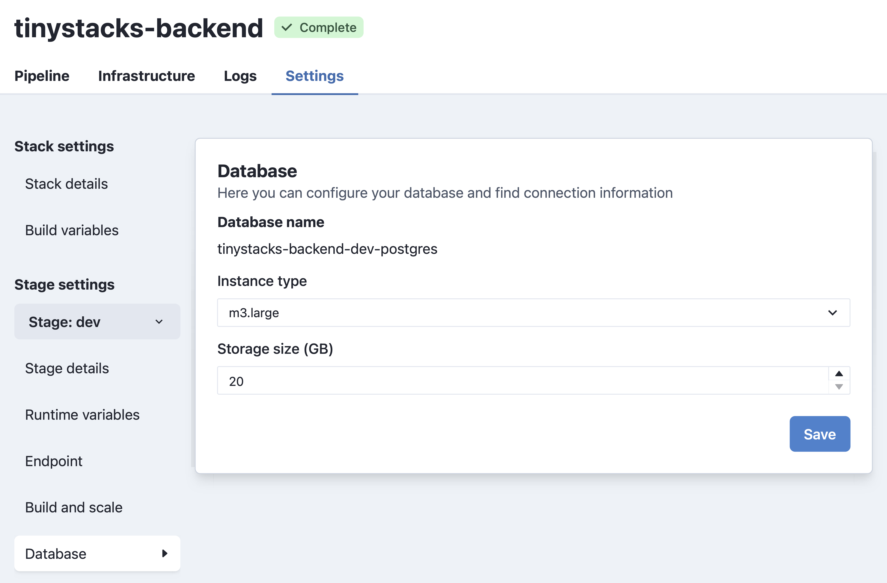
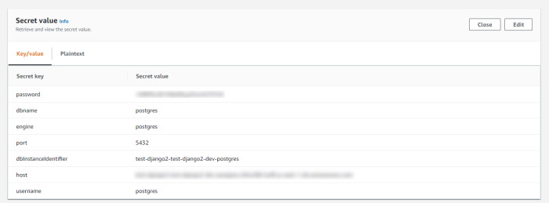

TinyStacks supports creating a Postgres database as part of your stack. You can also choose to pass in a database 

### Changing your stack's database settings

<a href="https://tinystacks.com/stacks/" target="_blank">Go to your Stacks page</a> and, for the stack you want to modify, click the gear icon in the lower right corner. This will open the **Settings** page. In the left hand column, under **Stage**, select the stage to which you want to add a database. Then, from the same column, select **Database**. 

You will see two different screens here depending on whether your stage currently has a database or not. If it has a database, you will see a screen that enables you to change the instance type for your database as well as the amount of disk storage used. 



If your stage currently has no database, you will see the following screen. You can either add a new Postgres database, or add another existing AWS database to your stack. 


*Note*: Saving your changes will trigger a rebuild of your stage. Your application may not be accessible on this stage until the rebuild and redeploy has completed. 

### Connecting to your Postgres database from your application

When you have TinyStacks create a Postgres database for you, we push all information about the database - including username and password - into a set of runtime variables. These are exposed to your application as environment variables in your Docker container instances. 

The variables pushed include: 

* **PG_HOST**: The IP address
* **PG_PORT**: The port on which the Postgres database is running
* **PG_CREDENTIALS_SECRET**: The password for connecting to your Postgres database
* **PG_DATABASE**: The name of the database on the database host server

Your application code should be able to access these values the same as it would any other environment variable (e.g., <a href="https://nodejs.dev/learn/how-to-read-environment-variables-from-nodejs" target="_blank">`process.env` in Node.js</a> or <a href="https://www.nylas.com/blog/making-use-of-environment-variables-in-python/" target="_blank">`os.environ.get()` in Python</a>).

### Connecting to your Postgres database from outside of your application

On top of pushing Postgres database connection information to your application as runtime variables, Tinystacks stores your credentials securely in your AWS account using <a href="https://console.aws.amazon.com/secretsmanager/" target="_blank">AWS Secrets Manager</a>. You can see these secrets by navigating to AWS Secrets Manager in your AWS account. 


You can identify the correct secret for your application from the AWS Console in two ways: 

* The **Secret description** of the stack, which will contain the name you gave your stack at stack creation time. 
* The tag **aws:cloudformation:stack-name**, which will also contain the name of your secret. 

If you have multiple stages, you will have multiple secrets. You can distinguish them by the name of the secret, which will have the name of the stage pre-pended. In this example, since this is our Postgres database for our dev stage, it starts with te prefix `dev`. 

In the AWS Console, you can see the information stored in this secret by expanding the **Secret value** dropdown. There, you can see all of the information required to connect to your Postgres database. 



If you need to retrieve these values programmatically, you can do so using the AWS Command Line Interface (CLI) or any of the APIs available for programmatic access. For example, using the AWS CLI, you can retrieve the secret you need by searching for all secrets where the tag `aws:cloudformation:stack-name` matches your stack name. You can then use the command `jq` to filter out the return values to get the correct database for your stage. 

```
aws secretsmanager list-secrets --region us-east-1 --filters Key=tag-key Values=aws:cloudformation:stack-name Key=tag-value,Values=test-django2 | jq '.[][] | select(.Name|test("^dev"))
```