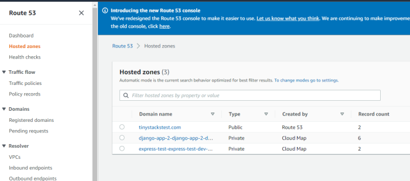
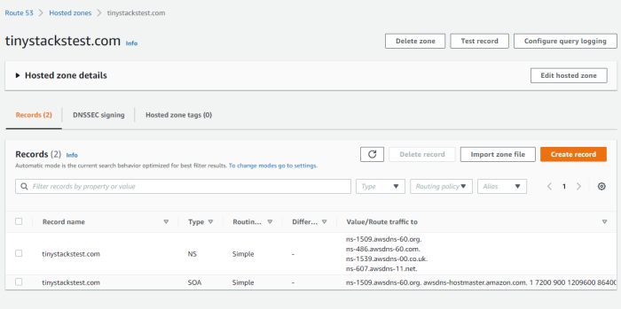
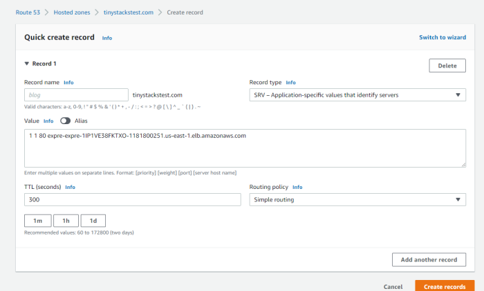
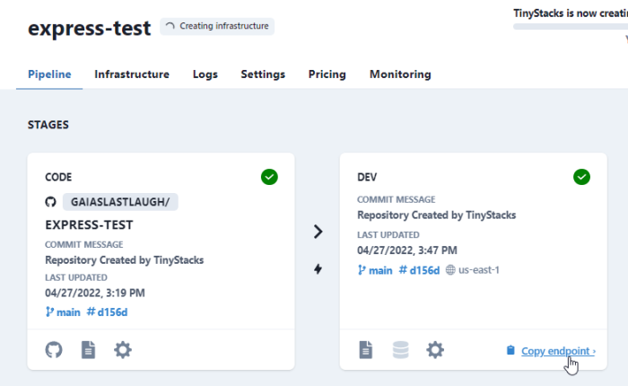
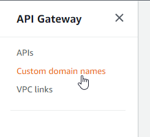
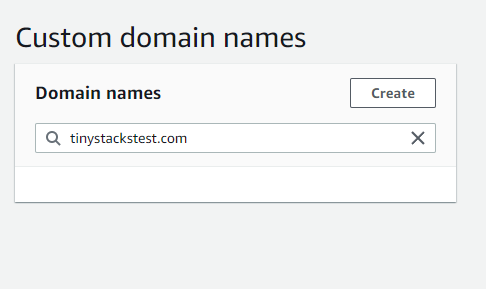
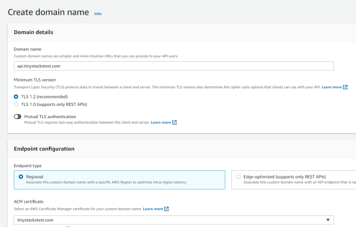
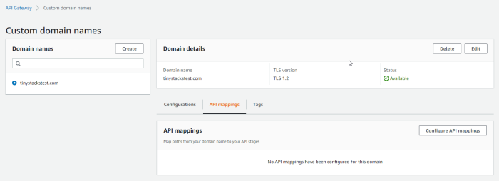
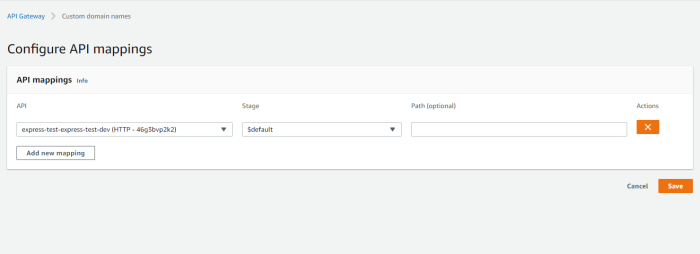
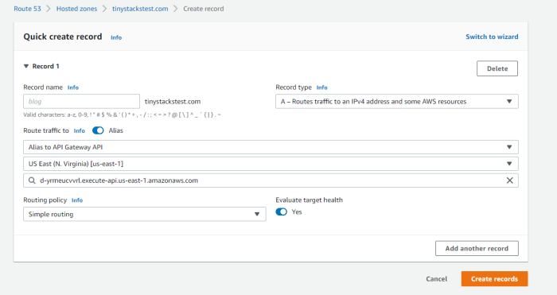

### Using your domain name

You can use your own domain name for your application's endpoint. How you set it up depends on whether you use API Gateway or Application Load Balancer (ALB) as your [endpoint technology](load-balancers.md).

#### Application Load Balancer

For ALB, you need only create a single DNS record pointing to the ALB's public endpoint. Use the following steps to set up DNS records for a domain whose DNS is managed by AWS. 

Navigate to Route 53 in your AWS account and selected **Hosted Zones**. From there, select the entry for your domain name. 



On the **Records** page, click **Create record**.



On the Create Record page, under **Record type**, select `SRV`. Then, under **Value**, enter a record in this format: 

```
1 1 80 alb-address
```

The results should look like this: 



The first two entries are the priority and weight; they're used for distributing traffic across multiple addresses. The third value is your port number; change it if you are serving your service or sidecar over a port other than 80. 

The last value is your ALB endpoint. You can copy this from the **Copy endpoint** command from the appropriate stage on your stack. Make sure to remove the prefix (http://) as well as the port number (the colon and everything after). 



Note that you can also create an A record as an alias to Application Load Balancer <a href="https://docs.aws.amazon.com/Route53/latest/DeveloperGuide/routing-to-elb-load-balancer.html" target="_blank">as discussed in the official AWS documentation</a>. We recommend using SRV records if you are running multiple images (e.g., [sidecars](sidecars.md)) in your stack, as SRV allows you to create domain entries that route traffic to different ports on the same host. 

#### API Gateway

There are a few additional steps for attaching your domain to an API Gateway endpoint. 

First, you will need to create an Amazon Certificate Manager (ACM) certificate for your domain name. For detailed steps, <a href="https://docs.aws.amazon.com/acm/latest/userguide/gs-acm-request-public.html" target="_blank">consult the AWS documentation</a>. Note that, if you wish to use a subdomain to expose your application (e.g., api.mydomain.com), you need to include that subdomain among the list of names covered by the certificate. 

Next, navigate to API Gateway in the AWS Console and create a custom domain name. In API Gateway, click **Custom domain names**.



Enter your domain name in the dialog box and click **Create**.



On the next page, under **Domain details**, enter a domain our a subdomain to use (e.g., api.domainname.com). Select the certificate you created earlier in the process as well. 



You now have a custom domain name in API Gateway. However, you still need to map it to your API. To do this, on the custom domain name's page, click **API mappings**.



Select your API from the **API** list. Your API Gateway for your deployed stage will contain both the name of your stack and the name of the stack/stage. For example, if your stack is named `express-test`, the `dev` stage will have the name `express-test-express-test-dev`. Leave all other parameters as their default values and click **Save**. 



The last step is to create an A record for your domain that maps your domain name to the endpoint you created for your custom domain name. Navigate to Route 53 and, under hosted zones for your domain, click **Create record**. From there, create an A record and select **Alias**. Then, select **API Gateway** and the region your endpoint is in. You should see the endpoint for your custom domain name in API Gateway in the drop-down list. 



You should now be able to navigate to your domain. Since your domain is hosted in AWS API Gateway, it uses HTTPS by default, so make sure to prefix your domain name with `https://` when typing it into a Web browser.

### HTTPS for your stack

Users of API Gateway get HTTPS connectivity by default. You can use your own domain with HTTPS by following the process outlined above for using a custom domain name with API Gateway. 

For Application Load Balancer, TinyStacks can incorporate your custom domain name and certificate into your stack for end to end SSL termination. Contact us to initiate the process. 