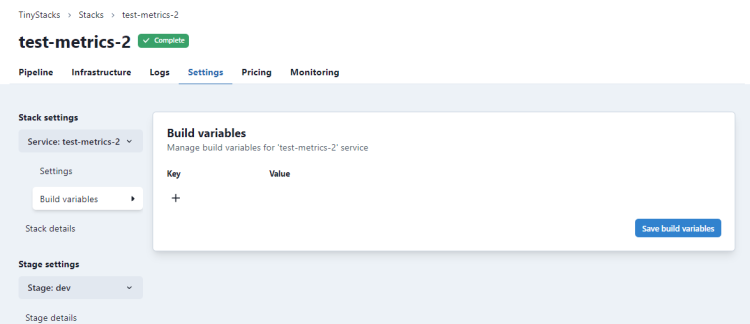
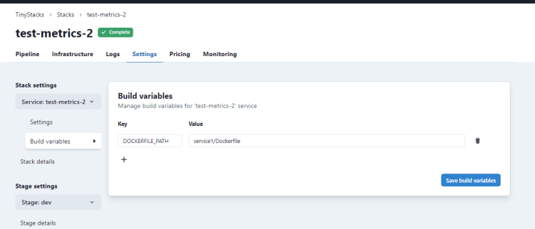

TinyStacks supports customizing your deployments through environment variables. We support two types of environment variables: build and runtime. 

## Build environment variables

Build environment variables are passed to your [build.yml file](builds-releases.md) as part of the container build process. You can use build environment variables to 

### Adding and using build environment variables

To add a build environment variable, you must first add it to your stack. On the TinyStacks dashboard, click the gear icon for your stack to go to its **Stack Settings** page. Under Build variables, you can add a new key-value pair by clicking the + button.



After you've defined the build environment variable here, you can pass it into your build.yml file to customize the build. 

### Example: Defining a build in a monorepo

For example, say that you wanted to use a monorepo architecture, in which you deploy multiple services from a single Git repository. 

By default, TinyStacks looks for your Dockerfile at the root of the repository. To use a different path, you could define it as a build environment variable in TinyStacks: 



Then, simply use this variable as the path to your Dockerfile by editing the build.yml to use the new variable: 

```
- docker build -t builtimage . -f $DOCKERFILE_PATH
```

(Note: We recommend adding this after adding the variable to your stack in the TinyStacks dashboard. If you add it before, the check-in will trigger a deployment in TinyStacks, which will fail as the variable is undefined.)

By defining a different path for each stack, you can use the same build.yml and release.yml files in a repo to deploy multiple services. 

## Runtime environment variables

Runtime variables are set on your Docker container images. They are copied over with each container image as a new image is run in response to an application scale event. 

Runtime variables are essential to adding additional functionality to your application. It's likely that your application already needs various runtime variables set in order to run. For example, you may need to supply credentials to a data store, such as DynamoDB, or information on how to connect to other microservices on which the application depends. Each stage of your application will likely need its own custom runtime variables, as the configuration and the resources to which your application connects will vary by stage. 

TinyStacks makes it easy to set runtime variables on your application that are unique to each stage. This enables you to have different configuration settings for your application depending on whether it's in dev, test, or production. 

### Adding or changing runtime variables per stage

Adding a new runtime environment variable is a two-step process.

To add or change runtime variables on your stack, <a href="https://tinystacks.com/stacks/" target="_blank">go to your Stacks page</a>. For the stack you want to modify, click the gear icon in the lower right corner. 


In the **Stage** dropdown on the left hand navigation menu, make sure you select the stage of your stack that you want to modify. Then, to see your runtime variables, click **Runtime variables**.


*Note*: If you had TinyStacks create a database for your stage, you may already see some variables for connecting to your database defined here. 

You can add any key-value pair you wish to your stage. When done, click **Save runtime variables** to save your changes. 

Next, you need to add support for passing the new variable into your Dockerfile. To do this, edit your Dockerfile to declare a variable of the same name with the Docker `ARG` command:

```
ARG FOO 
```

Finally, edit your build.yml file to pass this parameter to your container at build time using the `--build-arg` argument to the `docker build` command:

```
      - docker build -t builtimage . --build-arg FOO=$FOO
```

Once the rebuild and redeploy is complete, the key-value pairs you defined will be exposed as environment variables on your Docker container. Your application code should be able to access these values the same as it would any other environment variable (e.g., <a href="https://nodejs.dev/learn/how-to-read-environment-variables-from-nodejs" target="_blank">`process.env` in Node.js</a> or <a href="https://www.nylas.com/blog/making-use-of-environment-variables-in-python/" target="_blank">`os.environ.get()` in Python</a>).