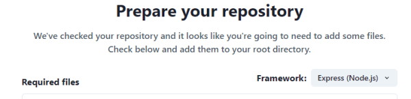
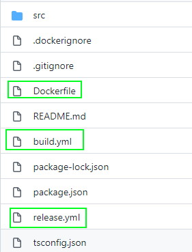

In our guide to [creating your first stack](/create-stack/), we showed you how to launch one of our sample applications as a fully scalable deployment on the cloud. But it's just as easy to package and deploy an existing application! 

## Prerequisites

This guide assumes you have set up connections to your Git and AWS accounts in TinyStacks. If you haven't done this yet, [follow the instructions for creating your first stack](/create-stack/).

Your Git account should contain a repository with the application code you wish to deploy. The application does not have to be containerized already (i.e., have a Dockerfile); we will provide a sample Dockerfile for you and some advice on containerizing your application in this guide. 

## Create a new stack

<a href="https://tinystacks.com/stacks/" target="_blank">From your Stacks page</a>, click **New Stack**. 

On the **Create your stack** page, select **My projects**. You should see a list of all of the repositories available in your Git account. Find the repository whose code you are going to deploy and click **Prepare to deploy**.

You should now be on the **Prepare your repository** page. 

## Check the deployment template files into your Git repository

When you choose to deploy code from an existing repository, TinyStacks checks your repo to see if it contains three files: 

* A `Dockerfile`. This file contains the instructions for preparing your Docker container, which will run your application code. Your container will need to contain your application framework (Express, Flask, Django, etc.), as well as any configuration files and environment variables necessary to run your application. 
* A `build.yml` file, which AWS CodeDeploy will use to create the latest version of your Docker container and store it in an Amazon Elastic Code Repository (ECR) repo in your AWS account. 
* A `release.yml` file, which AWS CodeDeploy will use to run your Docker container on an Amazon Elastic Container Service (ECS) cluster hosted in your AWS account. 

For more details on the elements of a TinyStacks deployment, [see our architecture page](/architecture/).

Since your Docker container must contain the framework required by your application, it's important that you click the **Framework** dropdown and select whatever framework your application uses. This will ensure that the `Dockerfile` that you download can successfully run your application. 

Once you've selected the correct framework, click **download all files** at the bottom of the page to download all three files as a zip file. Unzip this file and check in all of the missing files for your application to the root of your repository. 

The root directory of your repo should look something like the example below after you are done:

(*Note*: This example is for an Express app - your project may have different files if it is using a different framework. The important thing is that these three files are checked into the root of your repository.)

Once you are done, click **Next**. 

## Name your project and select the deployment branch

Next, give your project a name. Since this name will be used as a prefix for many of your AWS resources, keep it to 20 characters or less. 

You will also need to select a deployment branch. This is the branch of your Git repository on which new check ins will trigger a new deployment. 

When you're done, click **Next**.

## Finalizing deployment options

On the next screen, you will be asked to review your infrastructure before launching your application on TinyStacks. Click **Review infrastructure** to see the infrastructure that TinyStacks will create in your AWS account and to set any additional options. 

The options on this page are the same ones [discussed in the guide to creating your first stack](/create-stack/). Please review that document for a full description of the available options. 

For users launching an existing application, the Review Infrastructure page is a good time to consider what runtime configuration your application requires to run successfully. In particular, you should consider: 

* **Data storage**. You can create a new Postgres database in the **Databases** tile. If you need to use a different database, you can create or import an existing database into an Amazon RDS instance and then select it on this screen. 
* **Environment variables**. If you're using a database outside of AWS or need to specify additional configuration information for your application, use the Environment Variables link on this page to define simple name-value pairs. These variables will be exposed as Linux environment variables to your application running in its Docker container.

Once you're ready, click the **Build** button to build your Docker container and deploy it to AWS. 

## Testing your stack

Your stack will take a few minutes to build. Once it's done, you'll be taken to the **Stacks** page on your TinyStacks account, where you can see your running stack listed. 

Click on your stack's name to navigate to the Stack Details page. 

This page shows your stack and all of the stages you've defined. The initial stack creation process creates a single stage named `dev`. You can use the **Add stage** button to add more stages at any time.

For now, let's tets out the dev stack and ensure it's working. On the lower right corner of the `dev` box, click **Copy endpoint**. 

You can use this base URL to access a valid page or REST API call in your application. If everything is configured correctly, you should see your application return an appropriate response to your request.

## Properly containerizing your application

By following the steps above, your application should deploy and run in the cloud. However, you may notice some issues running your code if you haven't prepared your application to run in a container. 

[As explained in our architectural overview](/architecture/), a Docker container is a virtualized operating system that contains all of the executable files, scripts, shared libraries, configuration files and other dependencies required for your application to run. In order to scale your application to handle upwards of millions of requests, your AWS account will need to run multiple copies of this container across multiple virtual machines. 

If your application has been designed as a monolithic application, it may make certain assumptions about its runtime environment that won't hold true after your application is containerized. If you are seeing errors or strange behavior in your application, here are a few things to consider. 

### Filesystem storage

Each running Docker container instance has its own virtualized filesystem. Data written to this filesystem in one running container instance won't be visible to other running instances. Ensure that any data that all container instances must access is written to a shared location - e.g., a database, a cloud storage service like Amazon S3, or an in-memory cache server like <a href="https://aws.amazon.com/elasticache/" target="_blank">Amazon ElastiCache</a>.

### Configuration

Each running container instance will need its own copies of whatever configuration files your application might need. If you need to update any of these configuration files, you will need either to push changes through Git, or store the configuration in a location that all of your running container instances can access dynamically (such as Amazon S3). 