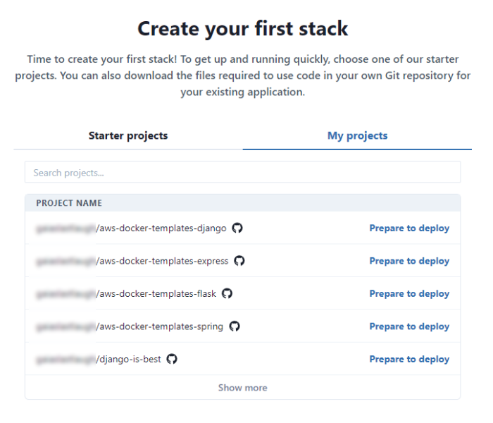
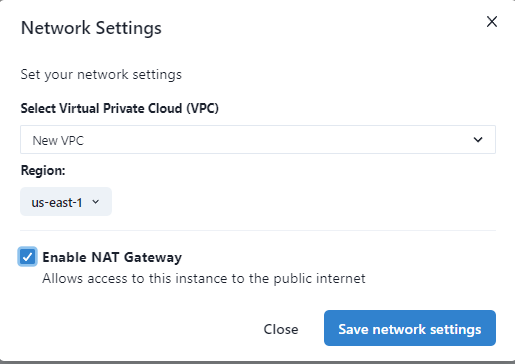

In our guide to [creating your first stack](create-stack.md), we showed you how to launch one of our sample applications as a fully scalable deployment on the cloud. But it's just as easy to package and deploy an existing application! 

## Prerequisites

Before you begin this guide, make sure you have set up your AWS and Git service connections as outlined in [Configure AWS and Git service connections](service-connections.md).

## Create a new stack

After you configure your connections, you'll be prompted to select a project. You can either select a TinyStacks starter project or use your own project. For this guide, we'll be using your own project. 

Select **My projects**. You should see a list of all of the repositories available in your Git account. Find the repository whose code you are going to deploy and click **Prepare to deploy**.

You should now be on the **Prepare your repository** page. 

## Check the deployment template files into your Git repository

When you choose to deploy code from an existing repository, TinyStacks checks your repo to see if it contains three files: 

* A `Dockerfile`. This file contains the instructions for preparing your Docker container, which will run your application code. Your container will need to contain your application framework (Express, Flask, Django, etc.), as well as any configuration files and environment variables necessary to run your application. 
* A `build.yml` file, which AWS CodeDeploy will use to create the latest version of your Docker container and store it in an Amazon Elastic Code Repository (ECR) repo in your AWS account. 
* A `release.yml` file, which AWS CodeDeploy will use to run your Docker container on an Amazon Elastic Container Service (ECS) cluster hosted in your AWS account. 

For more details on the elements of a TinyStacks deployment, [see our architecture page](architecture.md).

**Note**: If your app is already Dockerized (has a Dockerfile), you **do not** need to replace it with our Dockerfile. We only provide a Dockerfile for the benefit of teams who have no yet containerized their applications. 

Since your Docker container must contain the framework required by your application, it's important that you click the **Framework** dropdown and select whatever framework your application uses. This will ensure that the `Dockerfile` that you download can successfully run your application. 

Once you've selected the correct framework, click **download all files** at the bottom of the page to download all three files as a zip file. Unzip this file and check in all of the missing files for your application to the root of your repository. 

The root directory of your repo should look something like the example below after you are done:

(*Note*: This example is for an Express app - your project may have different files if it is using a different framework. The important thing is that these three files are checked into the root of your repository.)

Once you are done, click **Next**. 

## Name your project and select the deployment branch

Next, give your project a name. Since this name will be used as a prefix for many of your AWS resources, keep it to 20 characters or less. 

You will also need to select a deployment branch. This is the branch of your Git repository on which new check ins will trigger a new deployment. 

There are two other settings on this page you can optionally configure: 

* **Port**: If the application in your Docker container is using a port other than the default (80) to serve traffic, enter it here. 
* **Custom health check**: AWS services such as Application Load Balancer use health checks to determine if an instance of your application is running correctly. Instances that fail a health check are destroyed and replaced with healthy instances. By default, Tinystacks uses the endpoint `/ping` to check application health. If you use a different endpoint, specify it here. 

When you're done, click **Next**.

## Choosing serverless or container deployment

You have one more step to go and then you're ready to launch your stack! After clicking **Deploy**, you'll see the screen below. Here, you need to select whether to launch your application using either serverless or container architecture. 

To keep costs low for this initial walkthrough, select **Serverless**. (For more information on which architecture to choose for production applications, see (Architecture)[architecture.md] and (Serverless)[serverless.md].)

## Further customizing your deployment

This screen visualizes all of the AWS resources that TinyStacks will use or create on your behalf. These components and what they contribute to your stack are discussed in detail [in our architectural guide](architecture.md). Briefly, they include: 

* Your **Git repo** (either GitHub or GitLab) that holds your application code. 
* **AWS CodeBuild** to build and deploy your project as a Docker container. 
* An **Amazon Elastic Container Repository (ECR) repo** for storing your Docker container's versions. 
* An **Amazon Elastic Container Service (ECS) cluster** for hosting your running Docker containers. 
* **Amazon API Gateway** for routing traffic to your application's exposed endpoints. 
* **Amazon CloudWatch** for monitoring performance and storing application logs.
* An optional **database** for storing application data. 

Additionally, you can see and configure several additional options: 

* The **AWS pricing breakdown** gives you a sense of what you'll per month for your stack in its current configuration. 
* You can define **Environment variables** as name-value pairs that will be exposed as environment variables to your running application's Docker container. 

If a tile has a gear icon in the upper right corner, you can click it to configure advanced options for that tile. Configurable options include the following. 

### Configure Your VPC (optional for serverless)

If you choose container architecture, TinyStacks will by default create a new, secure VPC with three public and three isolated subnets. Your application will run into the isolated subnets. 

You can click the gear icon to opt instead to use your own pre-created VPC from your AWS account. You can use your own VPC that you created or a VPC that TinyStacks created for one of your other stacks. 

You can also option to turn the isolated subnets into private subnets by adding a NAT Gateway. This will enable applications running in these subnets to make calls out to the public Internet. You should enable this if your application has an external dependency, such as on a publicly hosted Web service. (Note: You will incur an hourly charge for your NAT Gateway as well as data transfer charges for every 1GB of data that flows to the Internet or to compute capacity in a different Availability Zone. See the [AWS NAT Gateway Pricing page](https://aws.amazon.com/vpc/pricing/) for more details.)

Note that serverless applications, by default, do not run in a VPC. You can, however, opt to run them in a VPC that's already defined in your AWS account. 

### Add a Database

Click **Enable** to create an Amazon RDS Postgres database for your account. Use the settings option to select an existing database instead and to configure other database-related options. 

### Amazon ECS (container architecture only)

Configure build and scale settings for your Amazon ECS cluster, such as the size of the Amazon EC2 instances used in your cluster. (If you're not familiar with these settings, you can leave them as the default for now.)

### AWS Lambda (serverless architecture only) 

Configure scale settings for your AWS Lambda function, including the memory available to your application and the runtime timeout setting. (If you're not familiar with these settings, you can leave them as the default for now.)

### Front-End Routing 

Choose between using Amazon API Gateway or Application Load Balancer for front end application routing. 

You can change any of these options now or change them later, after your original deployment. Your stack will also build as is, without any additional configuration. For now, start the creation of your first stack by clicking **Build**.

## Testing your stack

Once you're ready, click the **Build** button to build your Docker container and deploy it to AWS. 

Your application's environment will take a few minutes to build. We'll present detailed status updates in the upper-right corner of this as we build out your stack.

Once it's done, you'll be taken to the **Stacks** page on your TinyStacks account, where you can see your running stack listed. 

Click on your stack's name to navigate to the Stack Details page. 

This page shows your stack and all of the stages you've defined. The initial stack creation process creates a single stage named `dev`. You can use the **Add stage** button to add more stages at any time.

For now, let's tets out the dev stack and ensure it's working. On the lower right corner of the `dev` box, click **Copy endpoint**. 

You can use this base URL to access a valid page or REST API call in your application. If everything is configured correctly, you should see your application return an appropriate response to your request.

## Properly containerizing your application

By following the steps above, your application should deploy and run in the cloud. However, you may notice some issues running your code if you haven't prepared your application to run in a container. 

[As explained in our architectural overview](architecture.md), a Docker container is a virtualized operating system that contains all of the executable files, scripts, shared libraries, configuration files and other dependencies required for your application to run. In order to scale your application to handle upwards of millions of requests, your AWS account will need to run multiple copies of this container across multiple virtual machines. 

If your application has been designed as a monolithic application, it may make certain assumptions about its runtime environment that won't hold true after your application is containerized. If you are seeing errors or strange behavior in your application, here are a few things to consider. 

### Filesystem storage

Each running Docker container instance has its own virtualized filesystem. Data written to this filesystem in one running container instance won't be visible to other running instances. Ensure that any data that all container instances must access is written to a shared location - e.g., a database, a cloud storage service like Amazon S3, or an in-memory cache server like <a href="https://aws.amazon.com/elasticache/" target="_blank">Amazon ElastiCache</a>.

### Configuration

Each running container instance will need its own copies of whatever configuration files your application might need. If you need to update any of these configuration files, you will need either to push changes through Git, or store the configuration in a location that all of your running container instances can access dynamically (such as Amazon S3). 