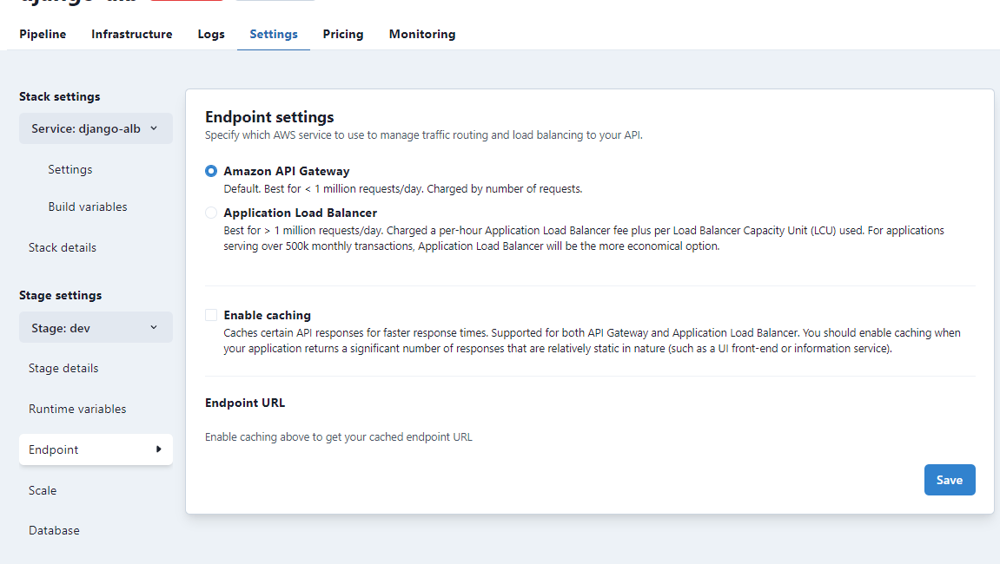

To access your application, it needs to have a publicly available domain name, or **endpoint**. 

TinyStacks enables customers to choose one of two technologies for exposing the application endpoint: **Amazon API Gateway**, AWS's REST API management service, or **Amazon Application Load Balancer** (ALB), a more general-purpose load balancer suited to a large variety of Web applications. 

Both technologies help provide secure access to your application. As discussed in [Networking](networking.md), TinyStacks doesn't expose your application directly on the Internet. Instead, we use API Gateway or ALB to expose only the port required for your application. This gives the virtual machines running in your ECS cluster additional protection against attack and attempted intrusion. 

As its name suggests, ALB also provides load balancing services. This means that requests to your service are balanced across the different instances of your containers running on your ECS cluster.

## Standard Scale Applications and Hyperscale Applications

The primary decision between choosing API Gateway versus ALB is how much traffic you expect your application to handle. We like to distinguish between two types of scale: 

* **Standard scale**: Applications serving under one million requests a day. 
* **Hyperscale**: Applications serving over one million requests.

In general, standard scale applications will find better price and performance using API Gateway. Hyperscale applications) will receive better price/performance from using API Gateway. 

For more details, <a href="https://blog.tinystacks.com/battle-of-the-serverless-api-routers-alb-vs-api-gateway-feature-comparison" target="_blank">see our blog post comparing API Gateway with Application Load Balancer</a>.

## Changing Your Load Balancer

You can change the load balancer your application uses at any time. This can be useful if your application's usage has increased from a standard scale to a hyperscale pattern. 

To change your load balancer, go to **Stack Settings** (the gear icon next to your stack on the TinyStacks dashboard) and select **Endpoint**. From there, you can switch your endpoint technology between API Gateway and ALB.

## Enabling Caching on Endpoint Requests

You can alternatively elect to enable caching on all endpoint requests. Enabling caching is best done for sites and services that act mostly as informational services or other scenarios where the return results are largely static.

On API Gateway, caching is enabled directly as a feature on the API Gateway service. For Application Load Balancer, TinyStacks implements its own caching mechanism.