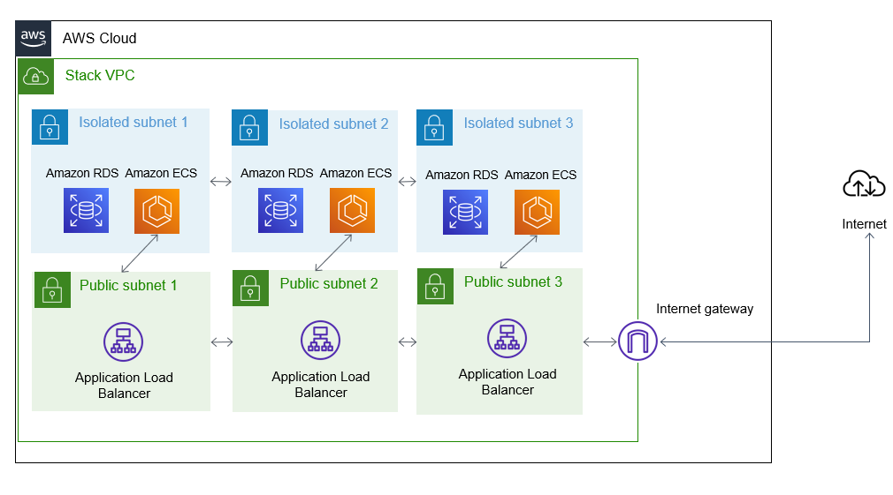

## The TinyStacks approach to networking 

Networking is one of the most complex aspects of setting up a new application stack on AWS. TinyStacks aims to change that. Our approach to networking is: 

* **Simple**. There is no complicated setup or configuration required in your application - our networking solution "just works". 
* **Secure**. Your code runs in an access-restricted environment in order to minimize potential surface attack area.
* **Cost-efficient**. Our approach saves our customers up to 70% compared to implementing a solution directly on AWS themselves. 

## Virtual Private Clouds (VPCs)

One of the most technically complex aspects of setting up infrastructure on AWS is creating your Virtual Private Cloud, or VPC. A VPC establishes the IP address ranges available to your application in its own isolated address space, defines routing between your applications and other VPCs and the public Internet, and sets out security rules that control how others can interact with your network.

A VPC defines a set of IP address ranges using logical groupings called subnets. Subnets can be one of three types: 

* **Public**: Traffic is allowed in from and out to the Internet and between subnets within the VPC. Inbound traffic is still often restricted to specific ports (e.g., ports 80 and 443 for Web apps). 
* **Private**: Traffic is allowed between subnets within the VPC. Requests can be made out to the public Internet via a NAT (see below for more details). 
* **Isolated**: Traffic is allowed between subnets within the VPC. There is no defined route for Internet requests.

By using a combination of private/isolated and public subnets, application developers can create a secure hosting environment that reduces an application's surface attack area and minimizes the risk of intrusion. 

Designing and deploying a secure VPC usually requires a solid knowledge of networking and of AWS. TinyStacks eliminates this requirement by deploying every stack with a secure VPC by default.

Each TinyStacks VPC consists of: 

* **Three public subnets**. These subnets contain any public-facing infrastructure (e.g., your Application Load Balancer or API Gateway endpoints).
* **Three isolated or private subnets**. These subnets contain your ECS cluster instances and your database (if you provisioned it with TinyStacks). During stack creation process, we ask you if you want to add a NAT instance to your subnets. If you choose to add a NAT instance, the subnets are private. If you choose not to add a NAT instance, they are isolated.　By default, we create a NAT instance and private subnets.

Both sets of subnets are spread across different AWS <a href="https://aws.amazon.com/about-aws/global-infrastructure/regions_az/" target="_blank">Availability Zones</a>. Critical resources are hosted across three separate subnets and Availability Zones. This helps protect against unexpected outages by placing the pieces of your infrastructure in geographically isolated data centers on AWS. For example, if you launch three Amazon ECS instances in your ECS cluster, we spread these evenly across all three availability zones This means your application can still keep serving traffic if a single availability zone goes down. 

How we connect your ECS cluster instances to the Internet depends on the scaling option you choose. If you use Application Load Balancer, the ALB can forward requests to your container instances by virtue of running in the same VPC. 

If you use API Gateway as your application front end, TinyStacks creates a VPC Link so that API Gateway can securely forward requests to your Docker container instances running on your cluster instances.

### Security groups

Security groups in AWS define which resources on AWS or the public Internet can access certain AWS resources. We define security groups that restrict access to protected resources. For example, ECS cluster instances can only be accessed by your API Gateway or Application Load Balancer front ends at the specific port that you specify at stack creation time. Likewise, only the ECS cluster instances can talk to the database (unless you create a bastion host, as described below), and only on a single dedicated port.

This architecture reduces your application's potential attack surface by only publicly exposing the minimal surface area required for your application to operate. 

### Network Address Translation (NAT)

By default, a private subnet can only communicate with compute instances running in other public or private subnets within the same VPC. For private subnets, TinyStacks will by default install a Network Address Translation (NAT) server in your VPC to enable request to the public Internet. 

There are two ways to host a NAT on AWS: 

* A NAT instance, a regular Amazon EC2 virtual machine that has been configured to serve as a router between your private subnets and the Internet
* NAT Gateway, an AWS managed service that provides scalable NAT capabilities within a VPC

TinyStacks uses NAT instances to minimize AWS charges to our customers. We configure your NAT instances to be part of an auto-scaling group. This ensures that the service doesn't become a bottleneck and scales out automatically if you are transmitting large amounts of data. 

#### Opting out of NAT

If your application doesn't require connecting to the public Internet, you can save on application stack costs by opting out of creating a NAT. At stack creation time, on the Infrastructure page, select the gear icon in the networking box on the upper right hand side of the screen. Then, in the **Network Settings** dialog box, uncheck **Enable NAT instance**.

### Bastion host

By default, we do not allow any Internet connectivity directly to your database. However, your team may need to access the database outside of your application (e.g., to run ad hoc queries or troubleshoot issues). 

To facilitate this, TinyStacks supports creating a <a href="https://aws.amazon.com/premiumsupport/knowledge-center/rds-connect-using-bastion-host-linux/" target="_blank">bastion host</a> for your database. The bastion host is an Amazon EC2 instance that sits in one of your public subnets and to which you can connect via SSH using a cryptographic key. Once on the bastion host, you can connect directly to your database in its isolated subnets. 