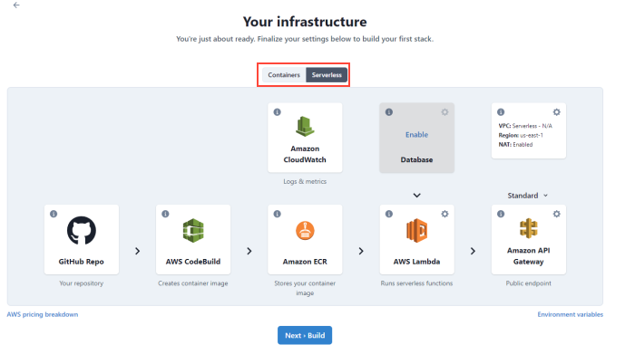

With TinyStacks, you have the option to run your code as a serverless application through <a href="https://aws.amazon.com/lambda/" target="_blank">AWS Lambda</a>. Running serverless confers several benefits: 

* It's cheaper for stacks or stages with low usage followed by large bursts of activity. With containers, an ECS cluster incurs a steady cost, as you are charged continuously for at least the minimum cluster capacity that you configured via TinyStacks. With Lambda, you're only charged for your code's actual execution time, which is measured on a per-millisecond basis.
* It's faster. The first access on a Lambda application can sometimes take a few seconds to load, as Lambda must download your code for the first time. After this initial access, however, Lambda applications execute subsequent requests very quickly. 

## Deploying a serverless stack

To deploy a serverless stack, [create a new stack](create-stack.md) and, on the Review Infrastructure screen, select **Serverless** as your architecture near the top of the page.

Note that there is no way to convert an existing stack between container and serverless. If you have an application running on container architecture, you will need to launch a new stack to convert it to running serverless.

## Configuring serverless architecture options

Once you've selected Serverless, you can configure a few additional options. 

### Networking

By default, your serverless application will not run in a [Virtual Private Cloud (VPC)](networking.md). You can change this by clicking the gear in the **Networking** box on this page and selecting an existing VPC from your AWS account.

### Configure Lambda scale settings

You can click the gear in the **AWS Lambda** box to select scaling options for your Lambda function. 

You can configure two options: 

* **Memory**. The memory, in megabytes, allotted to your Lambda function. This should be large enough to run your containerized application. You can raise this to a maximum of 10,240 MB.
* **Timeout**. How long your function can run without returning output to its caller before the connection is severed and no data returned. You should raise this value only if your function has a long initial start-up time, or is executing a long-running task. The maximum value is 900 seconds (15 minutes). 