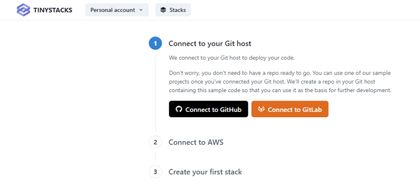

You will need the following resources set up before you start using TinyStacks: 

* A Git account with either <a href="https://github.com" target="_blank">GitHub</a> or <a href="https://gitlab.com" target="_blank">GitLab</a>.
* <a href="https://aws.amazon.com" target="_blank">An AWS account</a>. All of the resources TinyStacks creates for you will be hosted in an AWS account that you own. Don't worry - you cna get started without any previous knowledge of AWS!

## Configure Git connection

When you first log in to TinyStacks, you’ll need to wire up a supported Git repository account as well as an AWS account. TinyStacks supports using Git repositories hosted on GitHub or GitLab. 

Select which Git service you plan to use: GitHub or Gitlab. A separate window will open. If you are not logged in to your selected service, you will be prompted to log in now. 

Once logged in, you will need to grant authorization for TinyStacks to access your GitHub or GitLab account. This will allow us to add a repository to your account (if you use one of our starter projects) or read an existing repository (if you use your own project). 

For more information on administering service connections, in your account, see [Managing service connections](connections-manage.md).

## Configure AWS account 

Once you've authorized your Git account, you will be prompted to authorize an AWS account. This account will host all of the cloud resources required by your application. 

If you have not logged in to your AWS account recently, you will be prompted to do so. 

Once you have logged in to AWS, you will see the following screen, which prompts you to create an AWS CloudFormation stack in your AWS account. This step is **necessary** in order to proceed and fully connect your account. This CloudFormation template will create an AWS Identity and Access Management (IAM) role that TinyStacks will assume in order to create resources in your account.

(*Note*: Some elements of the screen above have been blurred out for security reasons.)

To create this stack, select the box **I acknowledge that AWS CloudFormation might create IAM resources**. Then, click the **Create Stack** button. 

After creating the stack, tab back to the previous tab containing the TinyStacks window. Once the stack has completed creating, TinyStacks will automatically detect this and move you to the next step in the stack creation process. Once you see the screen below, you can proceed. 

