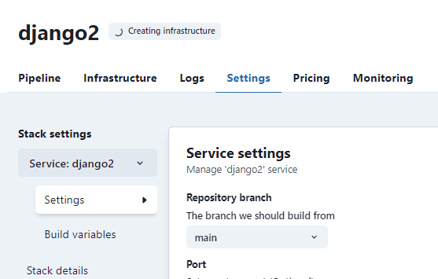

In TinyStacks, you can run multiple Docker images in the same stack. These are commonly called **sidecar** images, because they run alongside your main container and share resources with it (networking, storage, etc.). 

Sidecars are useful for providing ancillary services to your main Docker image. For example, you can use a sidecar to offload application logging to a secondary image.

To add sidecar Docker images, after you create your stack, navigate to the **Stack settings** page via the gear icon from the Stacks dashboard. Under Stack settings, click the dropdown next to **Service: <your service name>**, and click **Create new service**.

You can use two different methods to add a new service: 

* **Repository**. Specify a Git repository. TinyStacks will look for the same files it requires when building a Docker image for your primary stack. 
* **Image URL**. Use an existing Docker image URL. The repository containing the image must either be public or a repository in an AWS account [to which you have given TinyStacks access](create-stack.md). Alternatively, instead of a URL, you can specify the image name and version of an image in the Docker public repository(e.g., `python:3.9`). 

Once you're done, click **Create new service**. 

When the stack rebuilds, it will deploy your second container side by side on the same EC2 instances as your other running tasks. 

The images will scale together as you change your auto-scale settings. If you add an additional EC2 instance to your ECS cluster, we will create a new instance of each image on this new ECS cluster node. Memory and CPU resources on the instance are evenly split between all running container images.

## Sidecar Settings

You can set basic settings for your sidecar by navigating to your stack's **Stack settings** page. Underneath **Stack settings**, you will see a service drop-down. Click this to select your sidecar service from the list. 

From here, you can configure all of the settings discussed in [Basic Settings](basic-settings.md). 