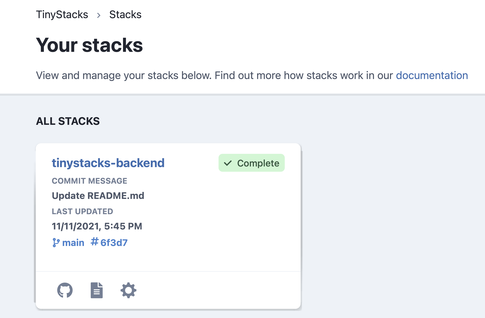
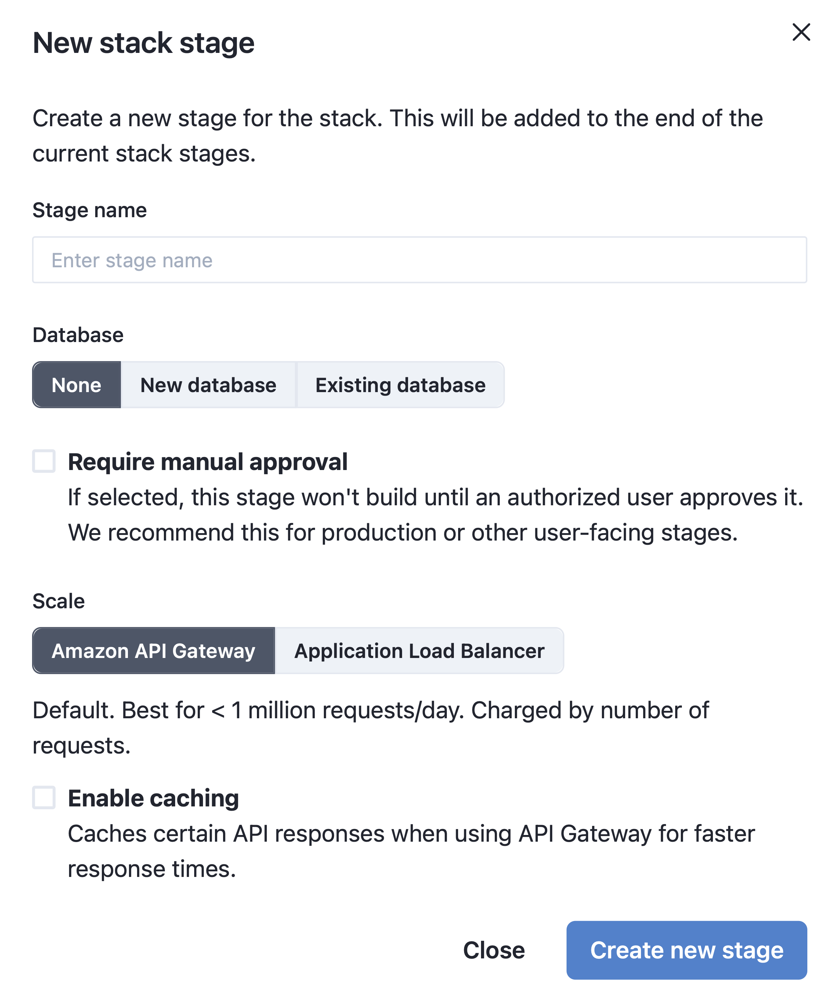

As discussed in [Concepts](concepts.md), stages are one of the fundamental building blocks of a TinyStacks release. A stage represents a deployment for a specific use case in the development process - such as development, testing, production release, etc. You can also use stages to manage multiple production deployments - e.g., for supporting multi-region deployments. 

By default, 

### Stage ordering

Stages are executed in the order shown in the TinyStacks dashboard. 

You can always add a new stage and insert it anywhere in the deployment order. It is not otherwise possible to change the position of a stage once it has been created; in that case, you will need to delete and re-create the stage.

### Stage Flow 

A check-in to a stack’s Git repository will flow through each stage in the order shown on the TinyStacks Dashboard. Each stage will build and deploy the checked-in changes to that stage’s stack. If the build and deployment are successful, the changes flow to the next stage, where they are also built and deployed. 

If an error occurs, the change will not flow to the next stage. This prevents changes that have failed to build or release in a given stage from propagating to later stages - e.g., your production environment. Stopping such failures earlier in the release process helps preserve the integrity and performance of your production application. 

#### Automatic and manual approvals

By default, if a change checked into a branch is built and deployed successfully by one stage, it will propagate automatically to the next stage. In most cases, however, your team will want to test and approve changes manually before pushing them into certain critical stages, such as production environments. 

TinyStacks enables you to configure any stage so that it requires a manual approval before changes flow from the previous stage. Manual approvals are done via the TinyStacks dashboard. 

### Adding a new stage

When TinyStacks created your stack, we created a single stage for you called `dev`. As discussed [in our concepts documentation](concepts.md), your team will likely want at least two stages - one for development and one for production. This allows you to test changes in your dev stage before releasing them to customers. 

To add a second stage, <a href="https://tinystacks.com/stacks" target="_blank">navigate to your Stacks page</a> and select your stack by clicking on its name. 

The next page will show all of the stages currently defined for your stack. To add a new stage, click the **Add stage** button.

On the **New stack stage** screen, you can configure your new stage. In the next screenshot, we've supplied a sample dialog for a `prod` stage that we explain in detail below:

* **Stage name**. Must be unique within this stack. Should indicate the role that this stage plays in your stack - e.g., dev, test, staging, prod, etc. In this case, we use the name `prod` to represent our production stage. 
* **Database**. Enables adding a new Postgres database or another existing Amazon RDS database to your stack. For now, we'll leave this option blank.
* **Require manual approval**. Since we're creating a production stage here, we'll check this box. 
* **Amazon API Gateway vs. Application Load Balancer**. Here, you can choose how you want to route requests to your application based on whether you expect your application will need to operate at standard scale or hyperscale. For now, we'll leave this to the default of Amazon API Gateway. For more information on scale settings, [consult our architectural overview](architecture.md).
* **Enable caching**. Whether to cache responses through API Gateway. This option is only available if using Amazon API Gateway. 

Once you've configured your stage to suit your needs, click **Create new stage**. The new stage will run and create, building the code that you most recently checked in to the stack's associated Git branch.

### Deleting a stage

You can delete a stage from the stage's settings page. To delete the stage, select **Stack Details** and click the **Delete stack** button. When prompted, confirm the deletion by typing the word `delete`. 

### Switching a stage from automatic to manual approvals

Sometimes, you'll want to move a stage from an automatic to manual approval. To do this, navigate to **Stack settings**. Underneath **Stage settings**, choose the stage you want to modify from the drop-down and then choose **Stage details**. Here you can mark the checkbox Requires manual approval to turn on manual approvals for the currently selected stage.

#### New stages pending and manual approvals

It's possible to insert a new stage before a stage that has a pending manual approval. In this case, the new stage will deploy the changes from its previous stage immediately. If you approve the release to the next stage, the deployment will occur immediately, even if the new stage is still in the middle of its deployment. 

### Configuring multi-region deployments

Many projects need to deploy their application to multiple regions for various reasons: 

* To support higher availability from clients in different locations around the world
* To deploy into a "canary" or test region
* To enable a backup or disaster recovery version of your application

You can easily support multi-region deployments by creating a new stage that targets a different AWS region. For example, let's say your existing production release targets AWS' us-east-1 region. You can create a second production deployment after that region that deploys the same infrastructure into a second region, such as us-west-2.

#### Canary region

One common pattern for multi-region deployments is for your initial production deployment to occur in <a href="https://blog.tinystacks.com/canary-testing-backend-api-aws" target="_blank">a canary region</a>. This is a "test" region that behaves exactly like production but is only used by your team (and, potentially, stakeholders or early adopters) to validate that a new release installs correctly and is performing in line with expectations. 

On TinyStacks, you can set up a canary region deployment easily. Assuming your application is primarily hosted in us-east-1 and that you wanted to set up a canary in us-west-2, you would: 

* Enable manual approvals on the production stage
* Create a new stage before the production stage (called something like `canary`) that installs into us-west-2
* Copy any build and runtime environment variables that your production stage uses into the new stage
* Wait for the deployment to finish and then test your application in us-west-2
* If the tests succeed, manually approve promotion of your changes to the production stage

Keep in mind that standing up another copy of your stack will incur additional costs for every minute it is running. Currently, y   ou can control costs in such deployments by reducing the amount of running infrastructure - e.g., by setting the number of desired instances in your ECS cluster to zero. 