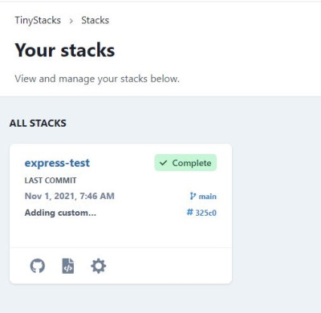
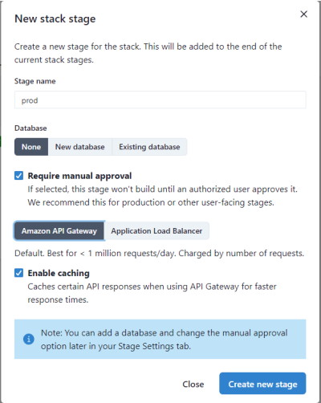

So you've got your first stack up and running. Now, it's time to tailor your stack to meet your team's needs. The following guide addresses the most common use cases for maintaining and expanding your stack. 

## ...add a new stage?

When TinyStacks created your stack, we created a single stage for you called `dev`. As discussed [in our concepts documentation](concepts.md), your team will likely want at least two stages - one for development and one for production. This allows you to test changes in your dev stage before releasing them to customers. 

To add a second stage, [navigate to your Stacks page](https://tinystacks.com/stacks) and select your stack by clicking on its name. 

The next page will show all of the stages currently defined for your stack. To add a new stage, click the **Add stage** button.

On the **New stack stage** screen, you can configure your new stage. In the next screenshot, we've supplied a sample dialog for a `prod` stage that we explain in detail below:

* **Stage name**. Must be unique within this stack. Should indicate the role that this stage plays in your stack - e.g., dev, test, staging, prod, etc. In this case, we use the name `prod` to represent our production stage. 
* **Database**. Enables adding a new Postgres database or another existing Amazon RDS database to your stack. For now, we'll leave this option blank.
* **Require manual approval**. By default, if a change checked into a branch is built and deployed successfully by one stage, it will propagate automatically to the next stage. In most cases, however, your team will want to test and approve changes manually before pushing them into production. Since we're creating a production stage here, we'll check this box. 
* **Amazon API Gateway vs. Application Load Balancer**. Here, you can choose how you want to route requests to your application based on whether you expect your application will need to operate at standard scale or hyperscale. For now, we'll leave this to the default of Amazon API Gateway. For more information on scale settings, [consult our architectural overview](architecture.md).
* **Enable caching**. Whether to cache responses through API Gateway. This option is only available if using Amazon API Gateway. 

Once you've configured your stage to suit your needs, click **Create new stage**. The new stage will run and create, building the code that you most recently checked in to the stack's associated Git branch.

## ...pass custom variables to my application? 

It's likely that your application will need various runtime variables set in order to run. For example, you may need to supply credentials to a data store, such as DynamoDB, or information on how to connect to other microservices on which the application depends. 

TinyStacks makes it easy to set runtime variables on your application that are unique to each stage. This enables you to have different configuration settings for your application depending on whether it's in dev, test, or production. 

To add or change runtime variables, [go to your Stacks page](https://tinystacks.com/stacks/). For the stack you want to modify, click the gear icon in the lower right corner. 

In the **Stage** dropdown on the left hand navigation menu, make sure you select the stage of your stack that you want to modify. Then, to see your runtime variables, click **Runtime variables**.

*Note*: If you had TinyStacks create a database for your stage, you may already see some variables for connecting to your database defined here. 

You can add any key-value pair you wish to your stage. When done, click **Save runtime variables** to save your changes. 

Setting new runtime variables will trigger a rebuild of your stack's stage. Once the rebuild and redeploy is complete, the key-value pairs you defined will be exposed as environment variables on your Docker container. Your application code should be able to access these values the same as it would any other environment variable (e.g., <a href="https://nodejs.dev/learn/how-to-read-environment-variables-from-nodejs" target="_blank">`process.env` in Node.js</a> or <a href="https://www.nylas.com/blog/making-use-of-environment-variables-in-python/" target="_blank">`os.environ.get()` in Python</a>).

## ...change my database and scale settings? 

When you create a stage, you can specify whether you want your application to use a database as well as your scale settings. If you need to change these at any time, you can do so through the stage's **Stage settings** page.

[Go to your Stacks page](https://tinystacks.com/stacks/) and, for the stack you want to modify, click the gear icon in the lower right corner. From here, you can click **Endpoint** to change how your application's endpoints are routed and load balanced on AWS. If you're currently using Amazon API Gateway but are beginning to handle more than 1 million requests/day, consider changing to Application Load Balancer instead.

You may also desire to change the size of the Amazon EC2 instances used in your Amazon ECS cluster. 

To change your database settings, click **Database**.

*Note*: Saving your changes will trigger a rebuild of your stage. Your application may not be accessible on this stage until the rebuild and redeploy has completed.

## ...connect to my Postgres database from my application? 

## ...change configuration data by stage? 

## ...deploy an application that uses a framework not directly supported by TinyStacks? 

While TinyStacks contains sample code for several popular application frameworks, our service is framework-agnostic. So long as your application can be packaged into a Docker container, it can run on TinyStacks!

## ....push custom Amazon CloudWatch metrics from my application? 

## ...give my application permission to access other AWS services? 

As you grow your application, you will likely want to incorporate access to other AWS services. Common examples include DynamoDB for NoSQL data storage and Amazon S3 for storing blobs and other large data. 

Currently, there are two ways to do this on TinyStacks: 

### Pass AWS Credentials as Environment Variables

### Modify the IAM Role for Your Application

