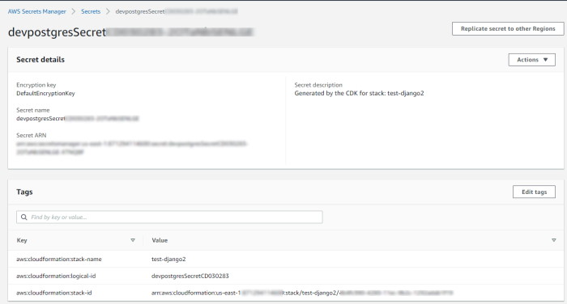
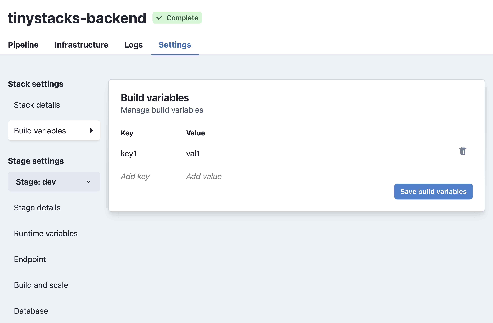

So you've got your first stack up and running. Now, it's time to tailor your stack to meet your team's needs. The following guide addresses the most common use cases for maintaining and expanding your stack. 

## Basic How Do I 

### ...add a new stage?

When TinyStacks created your stack, we created a single stage for you called `dev`. As discussed [in our concepts documentation](concepts.md), your team will likely want at least two stages - one for development and one for production. This allows you to test changes in your dev stage before releasing them to customers. 

To add a second stage, [navigate to your Stacks page](https://tinystacks.com/stacks) and select your stack by clicking on its name. 

{ width="75%"}

The next page will show all of the stages currently defined for your stack. To add a new stage, click the **Add stage** button.


On the **New stack stage** screen, you can configure your new stage. In the next screenshot, we've supplied a sample dialog for a `prod` stage that we explain in detail below:

{ width="75%"}

* **Stage name**. Must be unique within this stack. Should indicate the role that this stage plays in your stack - e.g., dev, test, staging, prod, etc. In this case, we use the name `prod` to represent our production stage. 
* **Database**. Enables adding a new Postgres database or another existing Amazon RDS database to your stack. For now, we'll leave this option blank.
* **Require manual approval**. By default, if a change checked into a branch is built and deployed successfully by one stage, it will propagate automatically to the next stage. In most cases, however, your team will want to test and approve changes manually before pushing them into production. Since we're creating a production stage here, we'll check this box. 
* **Amazon API Gateway vs. Application Load Balancer**. Here, you can choose how you want to route requests to your application based on whether you expect your application will need to operate at standard scale or hyperscale. For now, we'll leave this to the default of Amazon API Gateway. For more information on scale settings, [consult our architectural overview](architecture.md).
* **Enable caching**. Whether to cache responses through API Gateway. This option is only available if using Amazon API Gateway. 

Once you've configured your stage to suit your needs, click **Create new stage**. The new stage will run and create, building the code that you most recently checked in to the stack's associated Git branch.

### ...pass custom variables and configuration data to each stage?

It's likely that your application will need various runtime variables set in order to run. For example, you may need to supply credentials to a data store, such as DynamoDB, or information on how to connect to other microservices on which the application depends. Each stage of your application will likely need its own custom runtime variables, as the configuration and the resources to which your application connects will vary by stage. 

TinyStacks makes it easy to set runtime variables on your application that are unique to each stage. This enables you to have different configuration settings for your application depending on whether it's in dev, test, or production. 

To add or change runtime variables, [go to your Stacks page](https://tinystacks.com/stacks/). For the stack you want to modify, click the gear icon in the lower right corner. 


In the **Stage** dropdown on the left hand navigation menu, make sure you select the stage of your stack that you want to modify. Then, to see your runtime variables, click **Runtime variables**.


*Note*: If you had TinyStacks create a database for your stage, you may already see some variables for connecting to your database defined here. 

You can add any key-value pair you wish to your stage. When done, click **Save runtime variables** to save your changes. 

Setting new runtime variables will trigger a rebuild of your stack's stage. Once the rebuild and redeploy is complete, the key-value pairs you defined will be exposed as environment variables on your Docker container. Your application code should be able to access these values the same as it would any other environment variable (e.g., <a href="https://nodejs.dev/learn/how-to-read-environment-variables-from-nodejs" target="_blank">`process.env` in Node.js</a> or <a href="https://www.nylas.com/blog/making-use-of-environment-variables-in-python/" target="_blank">`os.environ.get()` in Python</a>).

### ...change my scale settings? 

When you create a stage, you can specify how you want your application to scale. If you need to change these at any time, you can do so through the stage's **Settings** page.

[Go to your Stacks page](https://tinystacks.com/stacks/) and, for the stack you want to modify, click the gear icon in the lower right corner. 

You have two choices for adjusting scaling for your application. Click **Endpoint** to change how your application's endpoints are routed and load balanced on AWS. If you're currently using Amazon API Gateway but are beginning to handle more than 1 million requests/day, consider changing to Application Load Balancer instead.


You may also desire to change how your Amazon ECS cluster scales. By default, TinyStacks will start two Amazon EC2 instances in your ECS cluster. We also define Amazon CloudWatch rules that implement the following behavior: 

* If the aggregate CPU usage of your ECS cluster instances exceeds 75% for more than 15 minutes, AWS will automatically add another EC2 instances to the cluster. 
* If the aggregate CPU usage of your ECS cluster instances is lower than 75% for more than 15 minutes, AWS will automatically remove an EC2 instance from the cluster. 

You may need to change these defaults if your application is either using too many underutilized resources or (more likely) is maxing out on available ECS cluster instances. 

To change scale settings, select **Build and scale** from the navigation menu on the **Settings** page. 


Here, you can change several settings. The first is your application's **instance sizing**. You can upgrade instance sizing if you are spinning up new ECS cluster instances too quickly. If you are currently using a t3.micro instance size, consider upgrading to an m3.medium or an m3.large.

You can also adjust your **autoscale min/max settings**. The following settings are available to change: 

**Desired capacity**

The number of ECS cluster instances to maintain if no auto scaling rules have been triggered by a CloudWatch alarm. 

The desired capacity should be set to a level that cna sustain normal, everyday traffic. If you set it too high, you will spend additional money on ECS cluster instances you aren't using. Conversely, if you set it too high, you may experience service interruptions, as it can take several minutes to initialize a new cluster instance.

**Min Capacity**

The minimum number of cluster instances to run regardless of auto scaling rules. As stated above, scaling up a new cluster instance can take time; setting a minimum number of instances ensures you always have "warm" cluster instances that are stood up and able to accept incoming traffic. 

**Max Capacity**

The maximum number of cluster instances to run regardless of auto scaling rules. This setting provides an upper boundary beyond which your application will not scale, which is  useful for controlling costs or responding to a potential denial of service attack. 

For more information on scaling of EC2 instances, <a href="https://docs.aws.amazon.com/autoscaling/ec2/userguide/asg-capacity-limits.html" target="_blank">see the AWS documentation</a>. 

*Note*: Saving settings changes will trigger a rebuild of your stage. Your application may not be accessible on this stage until the rebuild and redeploy has completed. Changing any of the settings in this section may result in increased AWS service costs. 

### ...change my stage's database settings? 

[Go to your Stacks page](https://tinystacks.com/stacks/) and, for the stack you want to modify, click the gear icon in the lower right corner. This will open the ***Settings** page. In the left hand column, under **Stage**, select the stage to which you want to add a database. Then, from the same column, select **Database**. 

You will see two different screens here depending on whether your stage currently has a database or not. If it has a database, you will see a screen that enables you to change the instance type for your database as well as the amount of disk storage used. 


If your stage currently has no database, you will see the following screen. You can either add a new Postgres database, or add another existing AWS database to your stack. 


*Note*: Saving your changes will trigger a rebuild of your stage. Your application may not be accessible on this stage until the rebuild and redeploy has completed. 

### ...connect to my Postgres database from my application? 

When you have TinyStacks create a Postgres database for you, we push all information about the database - including username and password - into a set of runtime variables. These are exposed to your application as environment variables in your Docker container instances. 

The variables pushed include: 

* **PG_HOST**: The IP address
* **PG_PORT**: The port on which the Postgres database is running
* **PG_CREDENTIALS_SECRET**: The password for connecting to your Postgres database
* **PG_DATABASE**: The name of the database on the database host server

Your application code should be able to access these values the same as it would any other environment variable (e.g., <a href="https://nodejs.dev/learn/how-to-read-environment-variables-from-nodejs" target="_blank">`process.env` in Node.js</a> or <a href="https://www.nylas.com/blog/making-use-of-environment-variables-in-python/" target="_blank">`os.environ.get()` in Python</a>).

### ...delete a stack? 

To delete a stack, [go to your Stacks page](https://tinystacks.com/stacks/) and, for the stack you want to modify, click the gear icon in the lower right corner. This will land you on the **Stack settings** page. There, you will find a **Delete** button. Click it, and type `delete` in the dialog box when prompted to confirm the operation. 

### ...delete a stage? 

To delete a stack, [go to your Stacks page](https://tinystacks.com/stacks/) and, for the stack you want to modify, click the gear icon in the lower right corner. This will land you on the **Stack settings** page. On the left hand navigation menu, under **Stage settings**, select the stage you want to delete. 

After this, select the **Stage details** link on the left hand navigation menu. There, you will find a **Delete Stage** button. Click it and, when prompted, enter `delete` to confirm the operation. 


## Advanced How Do I 

### ...add multiple Docker images to my stack?

TinyStacks supports multiple Docker images in your stack. 

To add a second Docker image, after you create your stack, navigate to the **Stack settings** page via the gear icon from the Stacks dashboard. Under Stack settings, click the dropdown next to **Service: <your service name>**, and click **Create new service**.


You can use two different methods to add a new service: 

* **Repository**. Specify a Git repository. TinyStacks will look for the same files it requires when building a Docker image for your primary stack. 
* **Image URL**. Use an existing Docker image URL. The repository containing the image must either be public or a repository in an AWS account [to which you have given TinyStacks access](create-stack.md). Alternatively, instead of a URL, you can specify the image name and version of an image in the Docker public repository(e.g., `python:3.9`). 

Once you're done, click **Create new service**. 

When the stack rebuilds, it will deploy your second container side by side on the same EC2 instances as your other running tasks. 

The images will scale together as you change your auto-scale settings. If you add an additional EC2 instance to your ECS cluster, we will create a new instance of each image on this new ECS cluster node. Memory and CPU resources on the instance are evenly split between all running container images.

### ...change the exposed port for my application? 

TinyStacks needs to know which port your application is serving HTTP traffic over in order to configure your Amazon ECS tasks properly. If you are using a port besides the standard port 80, you will need to change it in TinyStacks. 

To change your port, [go to your Stacks page](https://tinystacks.com/stacks/). For the stack you want to modify, click the gear icon in the lower right corner. On the **Stack Settings** page, under **Port**, input the number of the port on which your Docker container is exposing its services.


### ...connect to my Postgres database from outside of my application? 

On top of pushing Postgres database connection information to your application as runtime variables, Tinystacks stores your credentials securely in your AWS account using <a href="https://console.aws.amazon.com/secretsmanager/" target="_blank">AWS Secrets Manager</a>. You can see these secrets by navigating to AWS Secrets Manager in your AWS account. 



You can identify the correct secret for your application from the AWS Console in two ways: 

* The **Secret description** of the stack, which will contain the name you gave your stack at stack creation time. 
* The tag **aws:cloudformation:stack-name**, which will also contain the name of your secret. 

If you have multiple stages, you will have multiple secrets. You can distinguish them by the name of the secret, which will have the name of the stage pre-pended. In this example, since this is our Postgres database for our dev stage, it starts with te prefix `dev`. 

In the AWS Console, you can see the information stored in this secret by expanding the **Secret value** dropdown. There, you can see all of the information required to connect to your Postgres database. 


If you need to retrieve these values programmatically, you can do so using the AWS Command Line Interface (CLI) or any of the APIs available for programmatic access. For example, using the AWS CLI, you can retrieve the secret you need by searching for all secrets where the tag `aws:cloudformation:stack-name` matches your stack name. You can then use the command `jq` to filter out the return values to get the correct database for your stage. 

```
aws secretsmanager list-secrets --region us-east-1 --filters Key=tag-key Values=aws:cloudformation:stack-name Key=tag-value,Values=test-django2 | jq '.[][] | select(.Name|test("^dev"))
```

### ...pass custom data to the build process? 

Your `build.yml` file controls how your container is built and then stored in Amazon ECR. Sometimes, you may need to pass custom data at build time when building your Docker image. You can accomplish this by defining build variables for your stack. 

To define build variables, [go to your Stacks page](https://tinystacks.com/stacks/). For the stack you want to modify, click the gear icon in the lower right corner. On the **Stack Settings** page, click **Build variables**. Here you can define name-value pairs that you can reference in your `build.yml` file. 



### ...deploy an application that uses a framework not directly supported by TinyStacks? 

While TinyStacks contains sample code for several popular application frameworks, our service is framework-agnostic. So long as your application can be packaged into a Docker container, it can run on TinyStacks!

### ....push custom Amazon CloudWatch logs from my application? 

By default, TinyStacks creates a CloudWatch Logs log group for you. Any application output written to standard output (e.g., `console.log()` in Node.js) will appear in this log. 

### ...give my application permission to access other AWS services? 

As you grow your application, you will likely want to incorporate access to other AWS services. Common examples include DynamoDB for NoSQL data storage and Amazon S3 for storing blobs and other large data. 

Currently, there are two ways to do this on TinyStacks. Note that both operations require knowledge of AWS Identity and Access Management (IAM). 

**Pass AWS credentials as runtime variables**

You can create an AWS access key and secret key and pass these variables as runtime variables as described above in <a href="#pass-custom-variables-and-configuration-data-to-each-stage">passing runtime variables to a stage.</a>

Note that, if you do this, anyone with access to your TinyStacks account has access to these variables, and thus to your underlying AWS account. Please proceed with caution. 

**Modify the IAM role for your application**

Your Amazon ECS tasks all run with an IAM task role that determines their AWS permissions. The task role name is a combination of the stack name, the stage name, and the phrase "TaskRoleDefaultPolicy". For example, below is the IAM role for the dev stage for a stack named `test-django2`. 


By default, this role only has permission to push events to your Amazon CloudWatch Logs log group. You can modify it with a valid IAm policy to grant it access to additional AWS resources. 

### ...resolve errors when enabling logging? 

When TinyStacks attempts to enable logging on your stack, you may see the following error in the console: 

```
Cannot enable logging. Policy document length breaking Cloudwatch Logs Constraints, either < 1 or > 5120 (Service: AmazonApiGatewayV2; Status Code: 400; Error Code: BadRequestException;
```

To resolve this, run the following AWS CLI command. (You will need to have [the AWS CLI installed and configured for use](https://docs.aws.amazon.com/cli/latest/userguide/cli-chap-getting-started.html) with your AWS account.)

```
aws logs put-resource-policy --policy-name AWSLogDeliveryWrite20150319 --policy-document "{\"Version\":\"2012-10-17\",\"Statement\":[{\"Sid\":\"AWSLogDeliveryWrite\",\"Effect\":\"Allow\",\"Principal\":{\"Service\":\"delivery.logs.amazonaws.com\"},\"Action\":[\"logs:CreateLogStream\",\"logs:PutLogEvents\"],\"Resource\":[\"*\"]}]}"
```