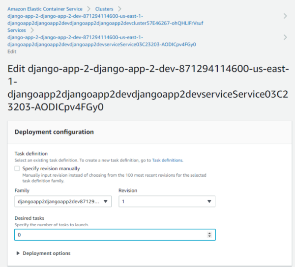
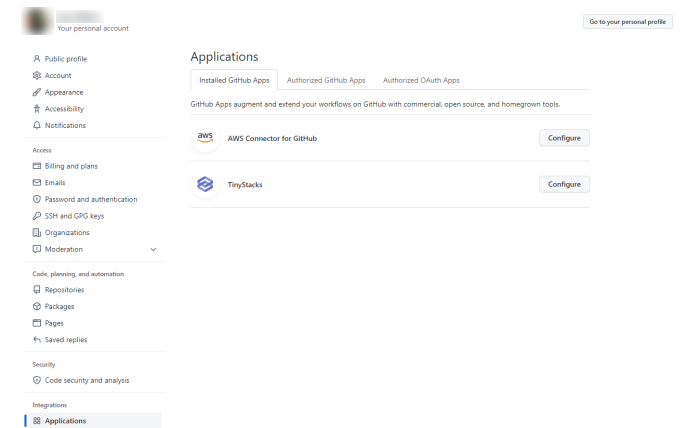
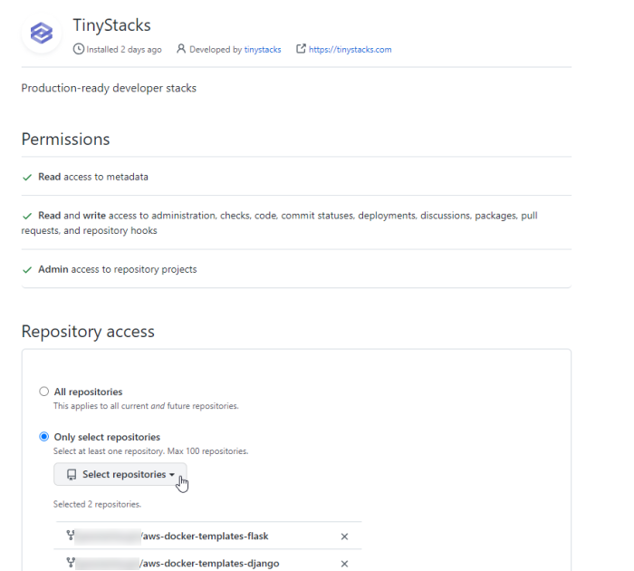

When using TinyStacks, you may run into the following issues. Most customers have resolved these issues with the tips below. If a given resolution doesn't work for you, [please contact us on our Discord channel](https://discord.com/channels/825074552085413966/825074552085413969) and we'll help you out. 

## Launch is stuck for several minutes

On occasion, you may see a stack launched stuck in one of its status states for several minutes. In these situations, it's possible that the stack has encountered an error that's preventing it from launching. 

Here are a few things you can check or try: 

### Check for CloudFormation errors

Sign in to the AWS Management Console and check the CloudFormation template's **Events** tab for any errors. (The template name will begin with the name of your stack.) It's possible the stack encountered an error in creating the Amazon ECS cluster, in which case the detailed error message should provide actionable information. 

### Drop the service's desired task count in ECS

If you're just standing up your initial infrastructure, there may be an issue with the application on your Docker container that's preventing your service from starting on ECS. Dropping your task count down to zero in the Amazon ECS Management Console can help skip over any such errors and ensure your stack finishes creating correctly. 

Find the ECS cluster with the same name as your stack and click on it. From there, click on the name of your service under **Services**. Click the **Edit** button and set the field **Desired tasks** to 0.



### Turn off the application's health check

If your application is failing its health check, this will stop the deployment from registering as completed. To do this, remove any custom health check setting. Navigate to **Settings** -> **Stack Settings** and then, under your service, select **Settings** to view and change your health check URL.

## Error When Enabling Logging: "Policy document length breaking CloudWatch Log Constraints"

When TinyStacks attempts to enable logging on your stack, you may see the following error in the console: 

```
Cannot enable logging. Policy document length breaking Cloudwatch Logs Constraints, either < 1 or > 5120 (Service: AmazonApiGatewayV2; Status Code: 400; Error Code: BadRequestException;
```

To resolve this, run the following AWS CLI command. You can run this command on the [AWS CloudShell](https://aws.amazon.com/cloudshell/), which has the CLI pre-installed and pre-authenticates you directly from the AWS Console. (Alternative, you can run this on your local computer if you have [the AWS CLI installed and configured for use](https://docs.aws.amazon.com/cli/latest/userguide/cli-chap-getting-started.html) with your AWS account.)

```
aws logs put-resource-policy --policy-name AWSLogDeliveryWrite20150319 --policy-document "{\"Version\":\"2012-10-17\",\"Statement\":[{\"Sid\":\"AWSLogDeliveryWrite\",\"Effect\":\"Allow\",\"Principal\":{\"Service\":\"delivery.logs.amazonaws.com\"},\"Action\":[\"logs:CreateLogStream\",\"logs:PutLogEvents\"],\"Resource\":[\"*\"]}]}"
```

## Error When Downloading Public Containers from Docker: "You have reached your rate pull limit"

When building your stack, the build may fail with the following message in the Build Log: 

```
You have reached your pull rate limit. You may increase the limit by authenticating and upgrading. 
```

The problem occurs when downloading an image from the Docker public registry. The issue is that Docker treats all requests coming from AWS in a specific region as coming from a single user. If too many other AWS users are pulling Docker images at the same time that your build is running, you could encounter this error. 

We have taken steps to limit the occurrence of this error, such as ensuring all Docker pull requests come from their own VPC. However, you may still see this error occur on occasion. To prevent it, you can edit your Dockerfile to switch out the base image used by your application and use an equivalent base image from the [Amazon ECR Public Gallery](https://gallery.ecr.aws/), which is not subject to the same request limitations. You will need to edit the `FROM` line of your Dockerfile to change how the image is pulled.

Below are links to equivalent images in the ECR Public Gallery for the sample applications published by TinyStacks: 

**Python**: Use the [Bitnami Python image](https://gallery.ecr.aws/bitnami/python) by editing your `FROM` line as follows:

```
FROM public.ecr.aws/bitnami/python:latest
```

**Node.js/Express**: Use the [Bitnami Node.js image](https://gallery.ecr.aws/bitnami/node) by editing your `FROM` line as follows:

```
FROM public.ecr.aws/bitnami/node:latest
```

We have modified the TinyStacks sample Docker applications to use these images from the ECR Public Gallery.

## Cannot see certain repositories in TinyStacks

If someone in your organization configured a GitHub connection to only allow access to certain repositories, you may not see a repository that you'd like to launch with TinyStacks. 

To change which repositories TinyStacks can access, go to <a href="https://github.com" target="_blank">github.com</a> and, on the right hand menu under your personal icon, select **Settings** -> **Applications**. 



From there, click **Configure** next to **TinyStacks**. From there, you can either allow all repositories or select additional repositories to make available to TinyStacks. 

